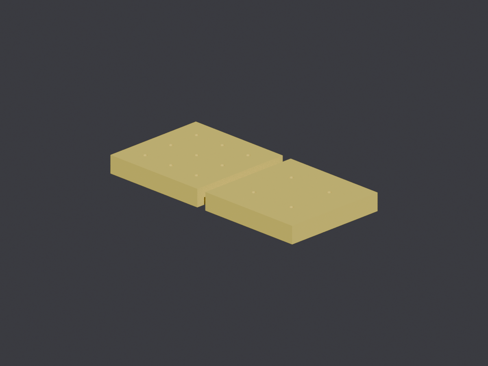
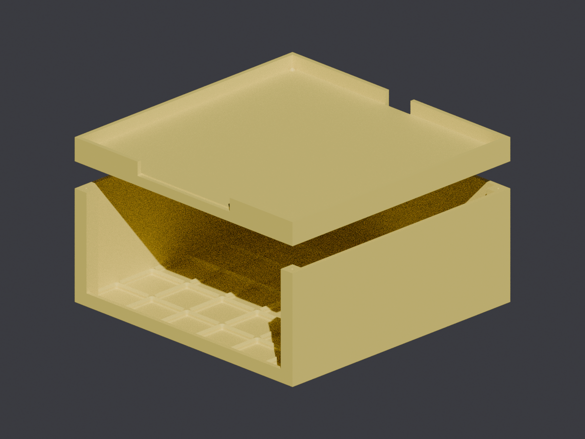
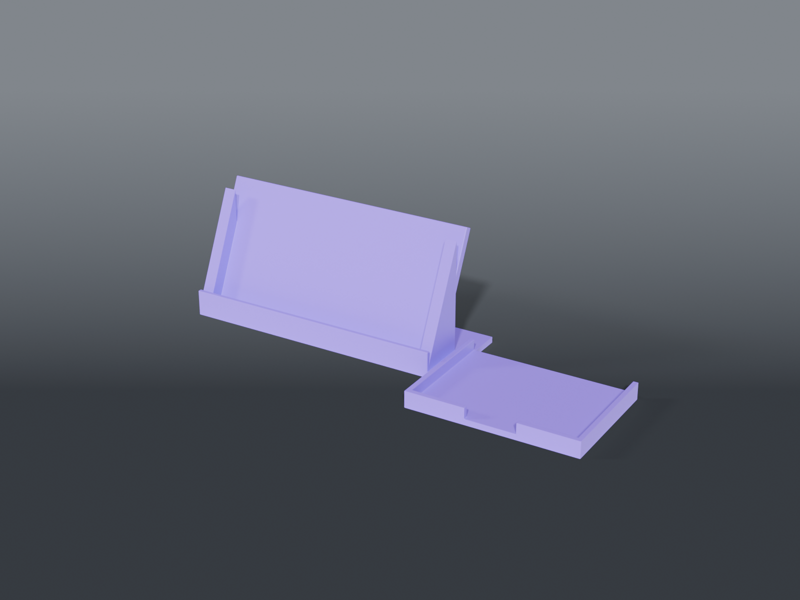

# 3d-printer-models

A collection of 3D-printable models authored as **OpenSCAD source**. STLs are rendered from source and published as [release](https://github.com/IamMrCupp/3d-printer-models/releases) artifacts (with Blender previews), not committed. Designed for a **Snapmaker U1** (270³ bed); most are portable to any FDM printer. Some designs may also go up on sharing sites (Printables, Thingiverse).

## Models

| | Model | What it is |
|---|---|---|
|  | [**Sticker-holder inserts**](sticker-holder-inserts/) | Organizer trays with a grid of square pockets for 2″ / 3″ square stickers. |
|  | [**Drybox splitter stand**](drybox-splitter-stand/) | Two-part stand that raises a PolyDryer splitter assembly 4.5″ with a Gridfinity storage cubby underneath. |
|  | [**VJ rig stand**](vj-rig-stand/) | iPad (TouchOSC) cradle + Magic Trackpad tray + cable holder for a VJ keyboard rig. |

Each model lives in its own directory with the parametric `.scad` source, a `README.md` (dimensions, print settings, parameters), and a Blender `preview.png`.

## Downloading prints

Each model is released independently. Printable STLs + a preview image are attached to the model's GitHub Release (tag `<model-slug>/vX.Y.Z`) — see [Releases](https://github.com/IamMrCupp/3d-printer-models/releases).

## Development

Models are authored in **OpenSCAD** (`.scad` = source of truth) and rendered to STL; previews are rendered in **Blender**.

```sh
tools/render.sh                       # render every model .scad → build/ and validate each mesh
tools/preview.sh <model.scad> <out.png>   # render a Blender preview PNG
```

`tools/validate_stl.py` checks a mesh is watertight / 2-manifold with a sane bounding box, using [trimesh](https://trimesh.org) when available and a zero-dependency fallback otherwise:

```sh
python3 -m venv .venv && .venv/bin/pip install -r requirements-dev.txt
```

On every PR, the [`validate`](.github/workflows/validate.yml) workflow renders all models and runs the trimesh check — a parameter edit that breaks geometry fails the build.

### Releases

Push a tag `<model-slug>/vX.Y.Z` and the [`release`](.github/workflows/release.yml) workflow renders that model's STL(s) + a Blender preview and publishes a GitHub Release:

```sh
git tag sticker-holder-inserts/v1.0.0
git push origin sticker-holder-inserts/v1.0.0
```

### Adding a model

1. Create `<model-slug>/` with the parametric `.scad` source (one shared `_common.scad` + part variants for multi-part models, like the existing ones).
2. Add a per-model `README.md` (dimensions, print settings, parameters) and a Blender `preview.png` (`tools/preview.sh`).
3. **Add a row to the Models table above** so the catalog stays current.
4. Open a PR (CI validates), merge, then tag `<model-slug>/v1.0.0` to release.

## License

[CC BY-NC 4.0](LICENSE) — share and adapt with attribution, non-commercial. See [`LICENSE`](LICENSE).

## Attribution / AI disclosure

Authored by Aaron Cupp. Some models and tooling are developed with assistance from Claude (Anthropic).
