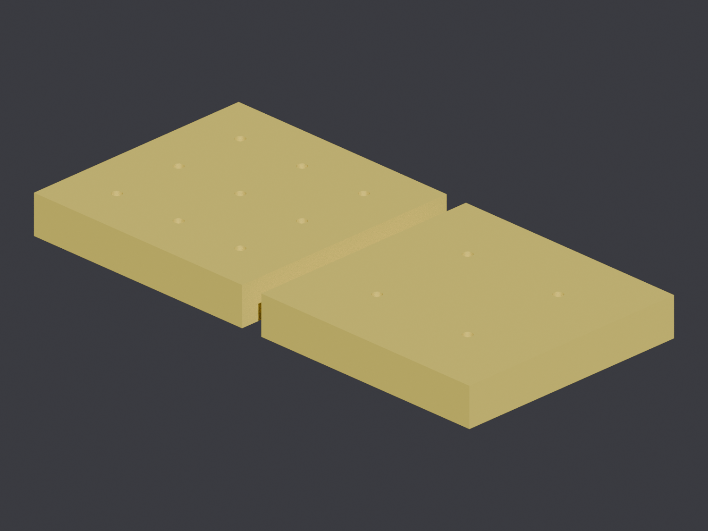
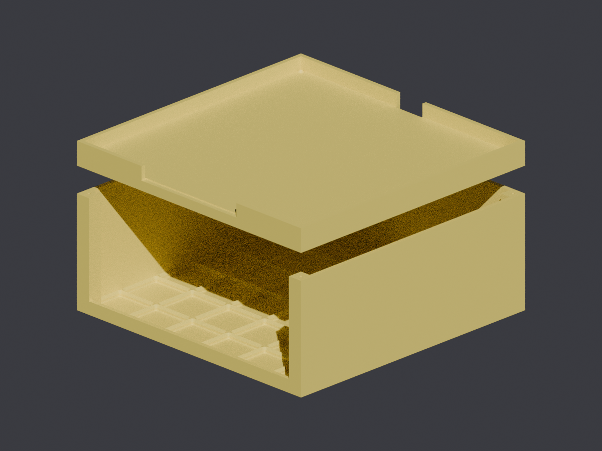
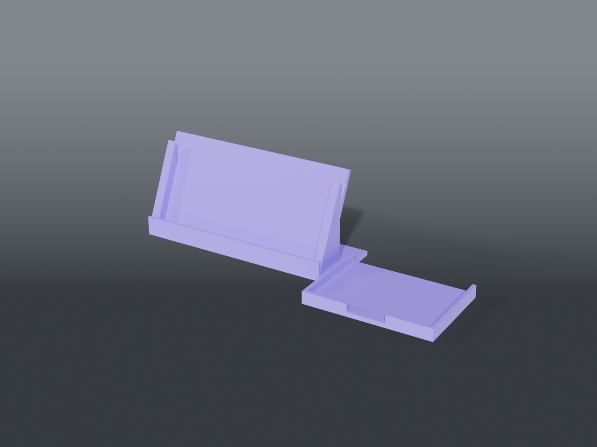
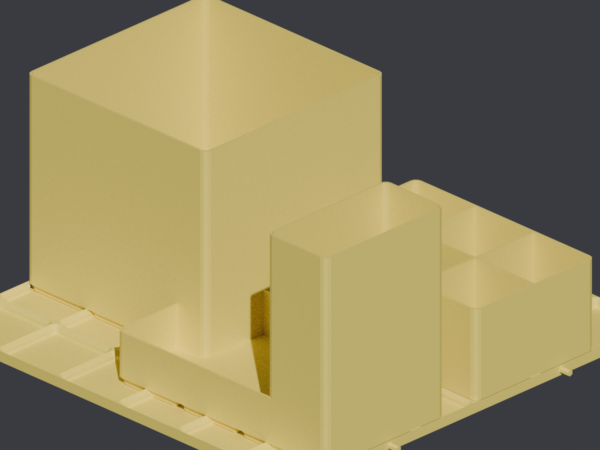
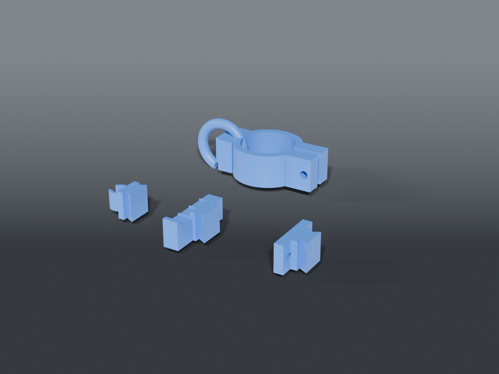
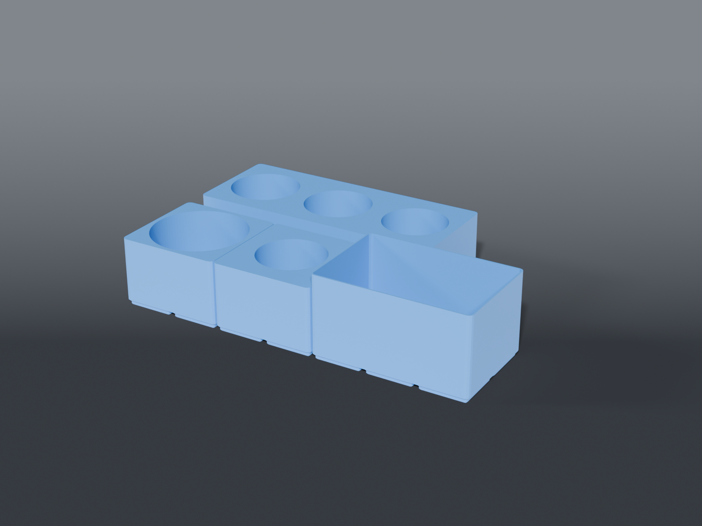

# 3d-printer-models

A collection of 3D-printable models authored as **OpenSCAD source**. STLs are rendered from source and published as [release](https://github.com/IamMrCupp/3d-printer-models/releases) artifacts (with Blender previews), not committed. Designed for a **Snapmaker U1** (270³ bed); most are portable to any FDM printer. Some designs may also go up on sharing sites (Printables, Thingiverse).

## Models

| | Model | What it is |
|---|---|---|
|  | [**Sticker-holder inserts**](sticker-holder-inserts/) | Organizer trays with a grid of square pockets for 2″ / 3″ square stickers. |
|  | [**Drybox splitter stand**](drybox-splitter-stand/) | Two-part stand that raises a PolyDryer splitter assembly 4.5″ with a Gridfinity storage cubby underneath. |
|  | [**VJ rig stand**](vj-rig-stand/) | iPad (TouchOSC) cradle + Magic Trackpad tray + cable holder for a VJ keyboard rig. |
|  | [**Apache 5800 cord organizer**](apache-5800-cord-organizer/) | Modular Gridfinity baseplate tiles + cord bins for an Apache 5800 case interior. |
|  | [**Stand cable clamp**](stand-cable-clamp/) | Wingnut clamp for round stand poles + slide-on cable heads (hook / clip / comb / velcro). |
|  | [**Donation QR stand**](donation-qr-stand/) | Desk stand with two-colour Venmo + CashApp QR codes for tips. Parametric — regenerate the codes for any URL. |
|  | [**Bench cleaning station**](bench-cleaning-station/) | Gridfinity cups + bins for an electronics bench's IPA corner — aerosols, wash bottle, dispenser pump, melamine sponges. |
|  | [**Rotary tool station**](rotary-tool-station/) | Vertical cup for a HARDELL mini rotary tool + a drilled block for its 3/32″ bits. Includes a print-first hole-fit gauge. |
|  | [**OWON SPM8104 top tray**](owon-spm8104-tray/) | Magnet-free Clickfinity tray that clamps onto an OWON SPM8104 PSU/DMM — 10 cells for the cord and barrel adapters. Screw-clamp rails, no adhesive. |

Each model lives in its own directory with the parametric `.scad` source, a `README.md` (dimensions, print settings, parameters), and a Blender `preview.png`.

## Downloading prints

Each model is released independently. Printable STLs + a preview image are attached to the model's GitHub Release (tag `<model-slug>/vX.Y.Z`) — see [Releases](https://github.com/IamMrCupp/3d-printer-models/releases).

## Development

Models are authored in **OpenSCAD** (`.scad` = source of truth) and rendered to STL; previews are rendered in **Blender**.

```sh
tools/render.sh                       # render every model .scad → build/ and validate each mesh
tools/preview.sh <model.scad> <out.png>   # render a Blender preview PNG
```

`tools/validate_stl.py` checks a mesh is watertight / 2-manifold with a sane bounding box, using [trimesh](https://trimesh.org) when available and a zero-dependency fallback otherwise:

```sh
python3 -m venv .venv && .venv/bin/pip install -r requirements-dev.txt
```

On every PR, the [`validate`](.github/workflows/validate.yml) workflow renders all models and runs the trimesh check — a parameter edit that breaks geometry fails the build.

### Releases

Push a tag `<model-slug>/vX.Y.Z` and the [`release`](.github/workflows/release.yml) workflow renders that model's STL(s) + a Blender preview and publishes a GitHub Release:

```sh
git tag sticker-holder-inserts/v1.0.0
git push origin sticker-holder-inserts/v1.0.0
```

### Adding a model

1. Create `<model-slug>/` with the parametric `.scad` source (one shared `_common.scad` + part variants for multi-part models, like the existing ones).
2. Add a per-model `README.md` (dimensions, print settings, parameters) and a Blender `preview.png` (`tools/preview.sh <scad> <out.png> [#hexcolor]`). Optionally drop a `preview-color.txt` (a hex like `#2BB3A3`) in the model dir — the release workflow uses it to tint that model's renders.
3. **Add a row to the Models table above** so the catalog stays current.
4. Open a PR (CI validates), merge, then tag `<model-slug>/v1.0.0` to release.

## License

Two licenses, split by what the thing *is*:

| What | License | Why |
|---|---|---|
| **The models** — every `<model>/` directory, the `.scad` files that produce a printable object, and the previews | [CC BY-NC 4.0](LICENSE) | share and adapt with attribution, non-commercial |
| **The code** — [`lib/`](lib/) and [`tools/`](tools/) | [MIT](LICENSE-MIT) | it's a software library; reuse it however you like, commercially included |

Creative Commons [recommends against using CC licenses for software](https://creativecommons.org/faq/#can-i-apply-a-creative-commons-license-to-software) — they don't address source vs. object code and carry no patent grant. So the parametric library and the build tooling are MIT, and the finished designs stay NC.

Every file in `lib/` and `tools/` carries an `SPDX-License-Identifier: MIT` header, so the split is machine-readable and travels with the file if you vendor it.

Some of these modules are also vendored into [`clickfinity-openscad`](https://github.com/IamMrCupp/clickfinity-openscad) (MIT throughout). Same author, same terms — take the library from either.

## Attribution / AI disclosure

Authored by Aaron Cupp. Some models and tooling are developed with assistance from Claude (Anthropic).
