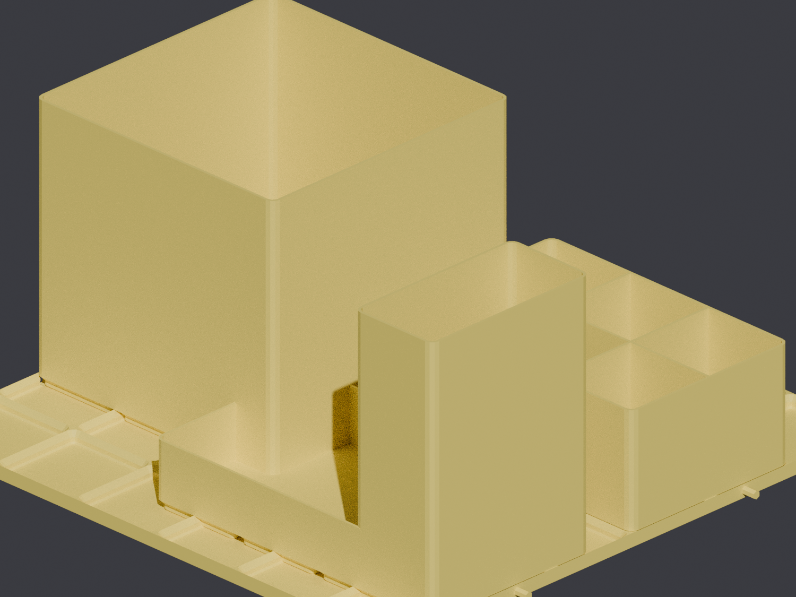

# Apache 5800 cord organizer



A modular **Gridfinity** organization system for the interior of an **Apache 5800** case (interior 514 × 289 × 144 mm), set up for cord storage. The floor is Gridfinity baseplate tiles; drop in whatever bins suit the cords you're storing — and rearrange anytime.

## Layout

- **Floor:** a 12 × 6 Gridfinity grid (504 × 252 mm) printed as **two 6 × 6 tiles**. They butt end-to-end (2 alignment pegs per mating edge keep them flush) and the case walls hold everything in place.
- **Cable channel:** the ~37 mm spare along one long side is left open as a full-length channel for power strips / long runs. Tiles sit against the other long wall, ~5 mm border at each end.
- **Depth:** the case is 144 mm deep, so bins up to ~130 mm tall fit.

## Parts

| File | What | Size |
|---|---|---|
| `baseplate_tile.scad` | 6 × 6 Gridfinity tile (**print 2**) | 258 × 252 × 6 mm |
| `bin_coil.scad` | Deep 3 × 3 bin — coiled cords / rolls | 125 × 125 × 120 mm |
| `bin_interconnect.scad` | 3 × 2 bin, divided 3 × 2 — small interconnects | 125 × 83 × 55 mm |
| `bin_tray.scad` | Shallow 3 × 2 tray — plugs / dongles | 125 × 83 × 30 mm |
| `bin_bundle.scad` | Tall 1 × 2 bin — stand a coiled bundle upright | 41 × 83 × 120 mm |

All bins are spec-correct Gridfinity, so **any standard Gridfinity bin** from any generator also drops into the tiles. Bin sizes are parameters (grid count, height, dividers) — tweak to taste.

Built on the shared [`lib/gridfinity.scad`](../lib/gridfinity.scad) baseplate + bin modules.

## Source

```sh
openscad -o baseplate_tile.stl --export-format binstl baseplate_tile.scad
openscad -o bin_coil.stl       --export-format binstl bin_coil.scad
# ...etc per part
```

## Recommended print settings

| Setting | Value |
|---|---|
| Orientation | All as modeled, base down. No supports. |
| Material | PLA or PETG |
| Layer height | 0.2 mm |
| Walls / perimeters | 3 (bins), 3–4 (tiles) |
| Infill | 15 % |
| Supports | None |

Tiles print at 252 mm — fits the U1's 270 mm bed. Print 2 tiles to fill the case; print bins as your cord collection needs them.
