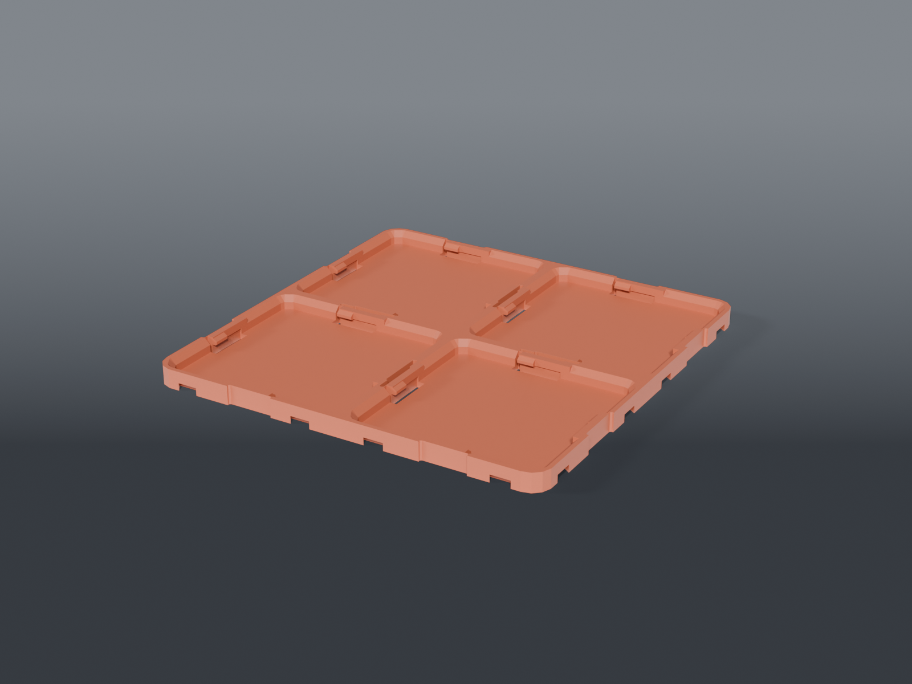

# Baseplates

Clickfinity baseplates for the bench zones — click-latch (magnet-free) bin retention plus edge dovetails so plates butt-and-slide to lock together.

## Joinable by policy

**All bench baseplates use `JOIN = true`** — male dovetails on +X/+Y, female slots on −X/−Y — so any two plates lock to each other. Print what a zone needs now and expand later: two 6×6 side by side gives a 12×6 surface.

Bins are standard Gridfinity and drop into the click arms unmodified.

## Parts

| file | grid | size |
|---|---|---|
| `baseplate_2x2_test.scad` | 2×2 | test tile — **print two of these first** |
| `baseplate_consumables_4x4.scad` | 4×4 | 168 × 168 mm — syringes / UV / rotary |
| `baseplate_cleaning_5x6.scad` | 5×6 | 210 × 252 mm — the cleaning zone |
| `baseplate_6x6.scad` | 6×6 | 252 × 252 mm — largest single piece the U1 bed takes |

With dovetails the 6×6 footprint is ~255 × 255, still inside the 270 mm bed.

## ⚠️ Print the 2×2 test tile first

Two of them, ~20 minutes each. Click a 1×1 bin in — does the latch hold? Slide the two tiles together on their shared edge — does the dovetail lock? That validates latch clearance and `JOIN_CLEAR` before you commit to a 7.5-hour plate.

Prints feet down, no supports.
