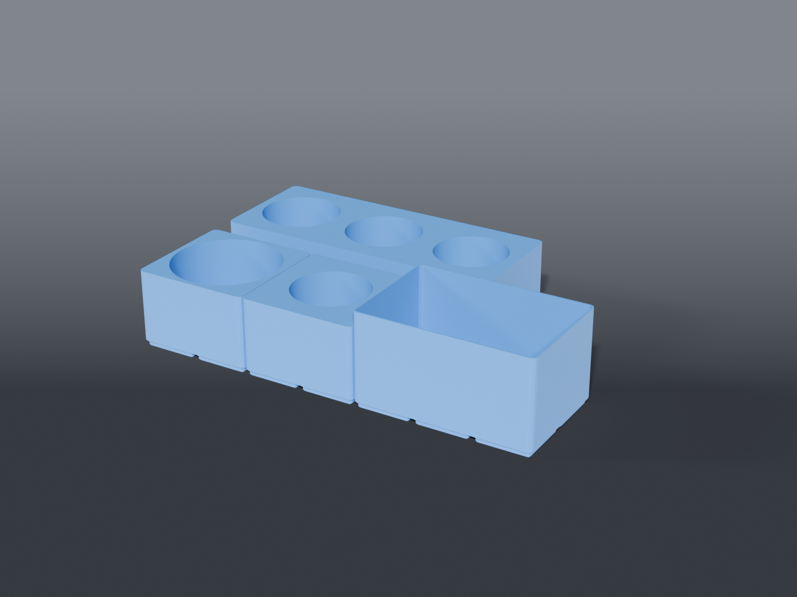

# Bench cleaning station



**Gridfinity** cups and bins for the IPA / contact-cleaner corner of an electronics repair bench — aerosols, wash bottle, dispenser pump, and melamine sponges.

Every dimension here was taken off the actual item with calipers. Nothing is a nominal from a product page, which matters: a collar cup is entirely a millimetre problem.

## Design notes

**Cups locate, they don't clamp.** Bores carry a per-diameter clearance (`CLR`, 1.0 mm), not an interference fit. A collar that grips harder than the bin weighs comes out of the baseplate with the bottle the first time you grab it one-handed.

**The bench this was built for sits under a fume-extractor intake**, so bins stay as low as the job allows — capture velocity is decided in the first six inches, and a wall of tall bins in front of the hood costs it.

**Capture depth is 50 mm** across all cups. That's a judgement call, not a derived third-of-height: the vessels' heights weren't measured. It's one constant (`CAPTURE`) if the first print feels wrong.

> ⚠️ **The aerosols are flammable and this bench has a 400 °C iron on it.** These cups are for *working* cans. Bulk stock belongs away from the hood and away from the iron.

## Parts

| File | What | Size |
|---|---|---|
| `bin_aerosols.scad` | 5 × 2 three-can block — freeze spray + DeoxIT D5 + F5 | 210 × 84 × 56 mm |
| `bin_flood_bottle.scad` | 2 × 2 cup — Labvida 500 ml IPA wash bottle | 84 × 84 × 56 mm |
| `bin_dispenser.scad` | 2 × 2 cup — 200 ml push-down IPA pump | 84 × 84 × 56 mm |
| `bin_sponges.scad` | 3 × 2 bin — melamine sponges on edge (~4) | 126 × 84 × 68 mm |

### Why the aerosol block is 5 × 2 and not 4 × 2

Three cans measure 162 mm of bore, which looks like it fits inside 168 mm. It doesn't — bores also need webs *between* them and a wall *outside* them. At 4 × 2 the first two overlap by 0.10 mm and the outer one breaks through the side wall by 0.50 mm.

That version still renders as a perfectly watertight, 2-manifold mesh. Mesh validation tells you a part is *closed*, not that it's *correct*, which is why `lib/vessel.scad` now asserts on bore spacing and rejects it at render time.

At 5 × 2 it's still a win over three separate 2 × 2 cups: 210 mm instead of 252 mm.

### Why the sponge bin is 3 × 2

A melamine sponge is 100 × 60 × 20 mm (3.94 × 2.35 × 0.79 in). A 2 × 2 bin's interior is 81 mm, so a full sponge doesn't fit — 3 × 2 is the floor. They stand **on edge**, about four across: same capacity as flat-stacking but in a 68 mm bin instead of a 107 mm one, and any sponge pinches out instead of peeling off a pile. Sponges get trimmed down in use, so offcuts share the bin.

## Not included yet

Three items from this bench corner are still unbuilt, all for want of measurements:

- **Swabs** (foam and cotton) — no shaft diameter or length
- **Kimwipes** — only one dimension known (120.96 mm), and a 121 mm box in a 3 × 3's 123 mm interior is uncomfortably tight
- **DeoxIT D100L-25C** — ships as a boxed clamshell kit, not a bare bottle

There's no baseplate here either. Bins are independent of the total footprint, so the baseplate waits until the available bench width is known.

Built on the shared [`lib/vessel.scad`](../lib/vessel.scad) collar-cup and [`lib/gridfinity.scad`](../lib/gridfinity.scad) bin modules. Bins are spec-correct Gridfinity, so any standard bin drops into the same baseplate.

## Source

```sh
openscad -o bin_aerosols.stl --export-format binstl bin_aerosols.scad
```

Or render and validate everything at once with `tools/render.sh`.

## Recommended print settings

| | |
|---|---|
| Material | PLA or PETG (PETG if IPA contact is likely) |
| Layer height | 0.2 mm |
| Walls | 3 perimeters |
| Infill | 15 % |
| Supports | **None** — all bores are vertical and print without them |

The flood-bottle cup is the tightest part in the set: a 76.5 mm bore in an 83.5 mm block leaves a 3.5 mm wall. If a print comes out snug on the bottle, widen `CLR` rather than shrinking the bore.
