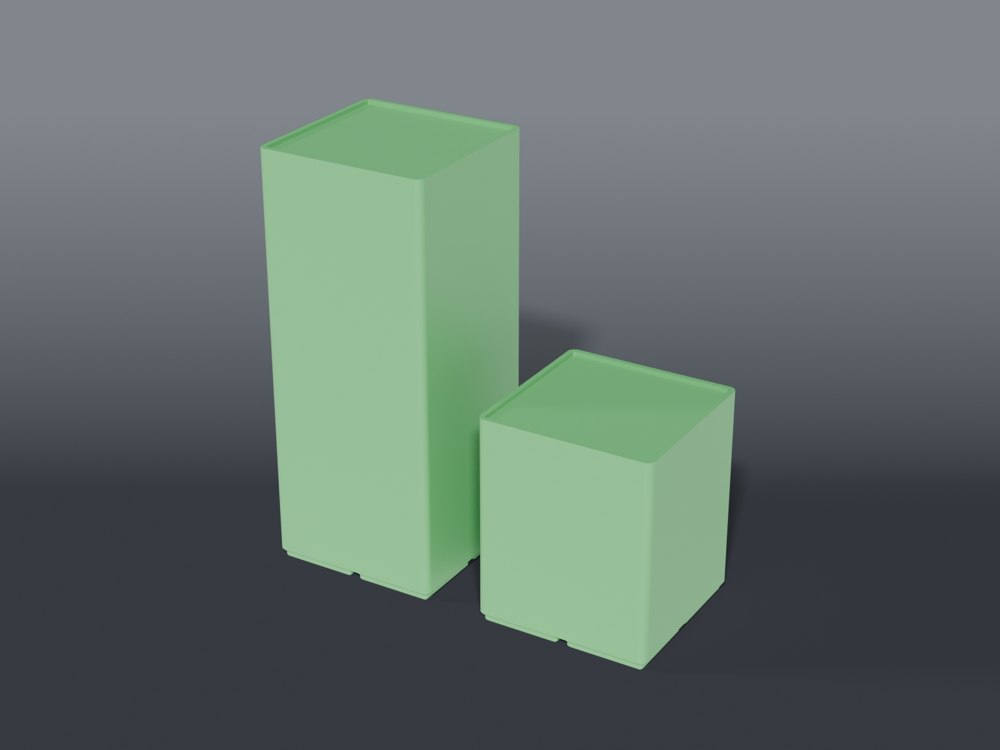

# Bench instrument risers



> **Print-tested.** A 4″ pedestal is printed and in service: the Gridfinity foot
> seats in a Clickfinity socket, the cap bridges the cavity without dishing, and
> the 78.5 mm pad has taken every instrument foot tried on it so far. That last
> one is the design working as intended — the top is a lip around a flat pad
> rather than a pocket cut for one specific foot, so pedestals stay
> interchangeable between instruments.

Pedestals that lift bench instruments off the desk and give their footprint back
as storage. Each one stands on **Gridfinity feet**, so it latches into a
Clickfinity desk plate instead of skating on wood. Put one under each instrument
foot and the space underneath becomes open grid.

Current bench:

| Instrument | Pedestals | Height |
|---|---|---|
| Hot air station | ×4 | 8″ (203.2 mm) |
| Oscilloscope ([OWON ADS1014D](https://www.owon.com.hk/)) | ×2 | 4″ (101.6 mm) |

The two heights are set by **different constraints**, which matters if either is
ever revisited. The scope's 4″ is a **sightline** number — it has to clear the
trays standing in front of it (logic analyzer, programmers), so it's driven by
what's in the way, not by what fits underneath. The station's 8″ is a working
height off the station itself. Storage underneath is a by-product of both.

The scope only needs to be *seen* — it's the instrument you stare at and rarely
touch — which makes it the one thing on the bench that can afford to give up
prime desk real estate and go up.

## Parts

| Part | File | Size | Print |
|---|---|---|---|
| **Hot air pedestal** | `riser_pedestal_hotair.scad` | 83.5 × 83.5 × 203.2 mm | ×4 — feet down, no supports |
| **Scope pedestal** | `riser_pedestal_scope.scad` | 83.5 × 83.5 × 101.6 mm | ×2 — feet down, no supports |

Both are the same module at different heights. Shared dimensions live in
`riser_common.scad`.

## The lip

The top is a shallow tray — a raised rim all the way round a recessed pad. It
captures whatever sits on it sideways **without knowing anything about that
instrument's feet**, so every pedestal stays interchangeable. A pocket or a slot
has to be cut where one specific foot lands, which makes the part bespoke and
throws that away.

Defaults are `LIP_W = 2.5` mm wide, `LIP_H = 2.0` mm tall — slight on purpose.
It only has to stop the instrument walking, and a taller rim risks fouling a
chassis that overhangs its own feet. `LIP_H = 0` gives a flat top.

**The one thing to check: the foot has to fit inside the pad.** A foot wider or
longer than the recess perches on the rim instead of sitting in the tray, which
is worse than no lip at all. The pad size is echoed at render time:

| Footprint | Pad |
|---|---|
| **2×2** — what both instruments use | 78.5 × 78.5 mm |
| 2×3 (`-D GY=3`) | 78.5 × 120.5 mm |

**The scope is settled at 2×2.** Its feet land on one cell and part of the next,
so two cells covers a foot with the pad to spare. The 2×3 stays available as a
flag for anything with a longer foot, but nothing on the bench needs it today.

## Height is what goes underneath

A pedestal's height **is** the clear height under the instrument, measured from
the same datum a bin sits on — the desk plate's socket floor — so it compares
directly against a bin's total height.

Clickfinity's latch **grips**: a bin comes out by pulling straight up against
four arms per cell. The clearance has to cover the bin, the release travel, and
room to get a hand in. Sizing to bin height alone builds a shelf whose bins you
can't extract. Rule of thumb — usable bin height is about `RISER_H − 40`:

- **8″ under the station** leaves ~160 mm — far past any bin in the repo
- **4″ under the scope** leaves ~60 mm, which clears the 55 mm OWON cord well

Neither height is a hard constraint. Override without editing anything:

```bash
openscad -o r.stl --export-format binstl -D RISER_H=90 riser_pedestal_scope.scad
```

## Hollow, and why the shell is thin

These were modelled solid at first, on the theory that infill percentage is the
right place to decide how much material a part uses. That doesn't survive a tall
pedestal. A solid 2×2 × 152 mm block is **1043 cm³**, and sliced four-up it came
out at **36 hours and 995 g — with 85% of that time in sparse infill alone.**
Walls were 3h40m of the job; infill was over thirty hours.

So the interior is removed in the model instead. What's left:

- the **Gridfinity feet, fully solid** — every latch surface untouched
- a **1.6 mm** perimeter shell (four 0.4 mm lines)
- **ribs on the cell boundaries**, which do triple duty: they carry load up the
  middle, they put material back exactly where the cavity would otherwise thin
  the internal foot walls, and they cut the cap's bridge span down to one cell,
  which is what makes a solid top printable over a hollow
- a 6 mm solid cap under the pad
- a **vent hole per cell** through the floor, so nothing is a sealed void

**The shell thickness matters more than it looks.** It started at 3 mm, and that
was a mistake worth recording: a 3 mm wall is wider than the perimeters can pack,
so the slicer fills it *solid* — which means the model's own volume is very close
to what you actually extrude. At 8″ that made each pedestal **415 g, worse than
the 249 g the solid version sliced at**. Hollowing wins on time, not
automatically on material, and only if the shell stays thin enough to be pure
perimeter:

| Shell / rib | Volume | Per pedestal @ 8″ | ×4 |
|---|---|---|---|
| 1.2 mm | 167 cm³ | 213 g | 0.85 kg |
| **1.6 mm** | **204 cm³** | **259 g** | **1.03 kg** |
| 2.4 mm | 275 cm³ | 349 g | 1.40 kg |
| 3.0 mm | 327 cm³ | 415 g | 1.66 kg |

1.6 mm is the default. Drop to 1.2 with `-D SHELL_T=1.2 -D RIB_T=1.2` if you want
the material back — it's still ~2,000 kg of crush capacity.

The cavity is structural, not usable storage. Storage goes in the open grid
*between* the pedestals, which is the point of raising anything.

## Cell budget — why the 8″ pedestals stay 2×2

At 203.2 mm on an 84 mm square footprint the hot air pedestals are **2.42:1**
tall against wide, past the `MAX_ASPECT` guideline of 1.6. Rendering echoes a
note rather than failing, and the obvious fix — widen to 3×3 — **doesn't work**:

| Footprint | Cells each | ×4 | On a 6×6 plate (36 cells) |
|---|---|---|---|
| 2×2 | 4 | 16 | 20 cells free |
| 3×3 | 9 | **36** | **zero free — fills the plate edge to edge** |

Four 3×3 pedestals tile an entire 6×6 baseplate, which removes every cell the
riser exists to create. **Plate capacity binds before foot spacing does.**

The aspect ratio is fine anyway, because the guideline checks a pedestal in
isolation and that isn't the situation. All four latch into **one shared plate**,
so their bases are tied together rigidly — no single post can tip, and they can't
splay relative to each other. Once the station is on, its chassis ties the tops
too. Structurally there was never a question: see the load numbers below.

## Load

A hot air station is 3–6 kg, so ~1.5 kg per pedestal. The hollow 2×2 section:

| Check | Capacity |
|---|---|
| Load-bearing cross-section | 778 mm² (shell + ribs) |
| Crushing | 39 kN ≈ 3,968 kg |
| Crushing, derated 80% for print voids | 794 kg |
| Euler buckling of the column at 8″ | 280 kN ≈ 28,567 kg |
| Cap dishing under a foot mid-cell | 1.41 MPa vs 50 MPa yield |

Three reasons the shell is enough. The load is **pure compression along the print
Z axis** — FDM's strong direction, since layer adhesion only matters in tension
and peel. A **closed box section** is enormously stiff in bending, and hollowing
removes material from the middle where it contributes almost nothing to `I`.
And the **ribs sit under the cap's bridge span**, so a foot anywhere on the pad is
at most ~18 mm from supported material.

## Source

Parametric OpenSCAD, on `lib/gridfinity.scad`. The asserts in `riser_common.scad`
catch what a mesh check can't — a lip taller than the material above the feet, a
rim wider than the corner radius it's offset from, a height that doesn't clear
the Gridfinity foot, anything past the 270 mm bed.

## Recommended print settings

| Setting | Value |
|---|---|
| Material | PETG |
| Layer height | 0.2 mm — 0.3 mm on the 8″ is fine, there's no fine detail above the foot |
| Walls | 3–4 |
| Infill | **5–10%** |
| Infill pattern | Lines or Grid |
| Supports | none |
| Orientation | as emitted, feet down |

**Don't raise the infill.** With a 1.6 mm shell there is barely any enclosed
volume left for infill to reach — it only touches the cap. Turning it up buys
nothing and re-creates the 36-hour problem the hollow was cut to solve.

## Still open

- **Scope tilt is deliberately undecided, and doesn't gate anything.** Its front
  bails still work sitting on the pedestals — deploy them for the same tilt 4″
  higher, stow them and it sits flat. No reprint either way. The only check if
  you deploy: a deployed bail contacts the pad further forward than a stowed
  foot, so it has to stay inside the 78.5 mm pad; if it creeps toward the rim,
  slide the pedestal a cell forward. Printing the front pair taller is a third
  option, only worth it if you want *more* tilt than the bails give.

- **The 8″ pedestals aren't printed yet.** Only the 4″ has been through a
  printer. Nothing about the taller one is different except `RISER_H`, so the
  seating and bridging results carry over — but it's 203.7 cm³ of model each,
  roughly 250 g and four of them, so it's worth being sure of placement first.
- **Hot air station foot spacing** — the pedestals have to land under its feet,
  and where they land decides whether the 20 free cells end up reachable at the
  plate edges or stranded under the middle of the station.
- Whether the station's underside vents. Four corner pedestals *improve*
  under-chassis airflow, so this is likely a bonus rather than a problem, but
  worth a look before committing.
