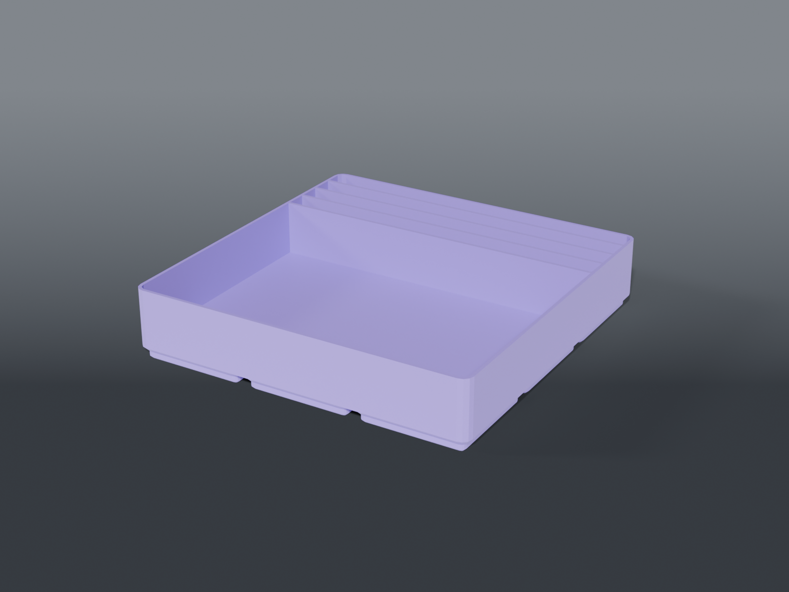

# BGA rack



**Gridfinity** 3×3 for the BGA reballing kit — the AMAOE jig lying flat, and four stencil bags
standing on end beside it.

## Why this shape

**The jig lies flat.** It's 85.17 × 85.18 × 15 mm, so at 20 mm deep it simply drops in.

**The stencils stand on end and stick out, on purpose.** The largest is 50 × 50, and a slot's job
is to hold them upright and sorted, not to swallow them. Sizing the bin to bury a 50 mm stencil
would nearly triple its height and make them harder to pinch out, not easier.

**3×3 because of one millimetre.** The jig is 85.18 across; a 3×2's short interior is 81.1. It
doesn't fit, so the footprint goes to 3×3 — 123.1 square, of which the jig bay takes 87.2 and the
remaining ~31 mm carries the slots.

**Four slots for four bags**, which are sorted by ball size. One bag per slot keeps that sorting
instead of pooling them.

## Parts

| File | What | Size |
|---|---|---|
| `bin_bga_rack.scad` | 3×3, one 87.2 mm jig bay + 4 × 7.78 mm stencil slots | 125.5 × 125.5 × 26.2 mm |

`N_STENCIL` changes the slot count; the widths redistribute automatically and an assert fires if
they'd collapse below 4 mm.

## Source

```sh
openscad -o bin_bga_rack.stl --export-format binstl bin_bga_rack.scad
```

## Recommended print settings

| | |
|---|---|
| Material | PLA or PETG |
| Layer height | 0.2 mm |
| Walls | 3 perimeters |
| Infill | 15 % |
| Supports | **None** |
