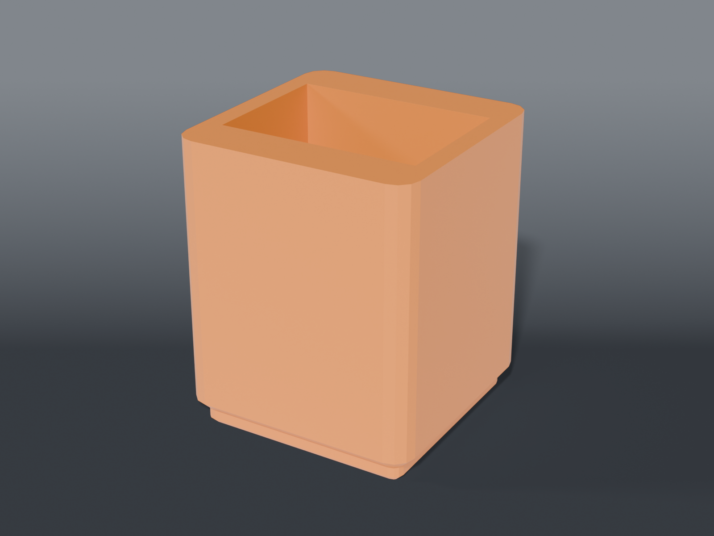

# Chip-puller vacuum cup

A **1×1 Gridfinity cup** that stands a handheld, rechargeable chip-puller vacuum upright, bottom end down, beside the board.

## Parts

| Part | File | Size | Print |
|---|---|---|---|
| **Vacuum cup** | `bin_chip_vacuum.scad` | 41.5 × 41.5 × 51 mm | ×1 — feet down, no supports |

## Sized from the vacuum

Calipered (`survey/MEASUREMENTS.md`, 2026-10-09): **34 × 24 × 170 mm** with its tip on, rectangular with slightly rounded corners. The bottom end is the largest part and goes into the cup.

- **Pocket 34.6 × 24.6, 45 mm deep.** 0.6 mm of clearance each way. The pocket's corners are square, so the vacuum's rounded corners never touch and the four flat sides do the holding.
- **Closed floor.** The charge port is on the bottom face, but it won't charge standing in the cup, so there's no cable slot.
- **45 mm of a 170 mm body** is a comfort choice. The cup latches into the grid, so nothing tips. It leans less than a degree and leaves plenty to grab.

The spare tip and suction cups go in a small bin you already have.

## Checked

A 34 × 24 body seated in the cup clears all four walls and rests on the floor. A body 1 mm larger collides with it, which confirms the check can fail.

## Recommended print settings

| Setting | Value |
|---|---|
| Material | PETG |
| Layer height | 0.2 mm |
| Walls | 3 |
| Infill | 15% |
| Supports | None |
