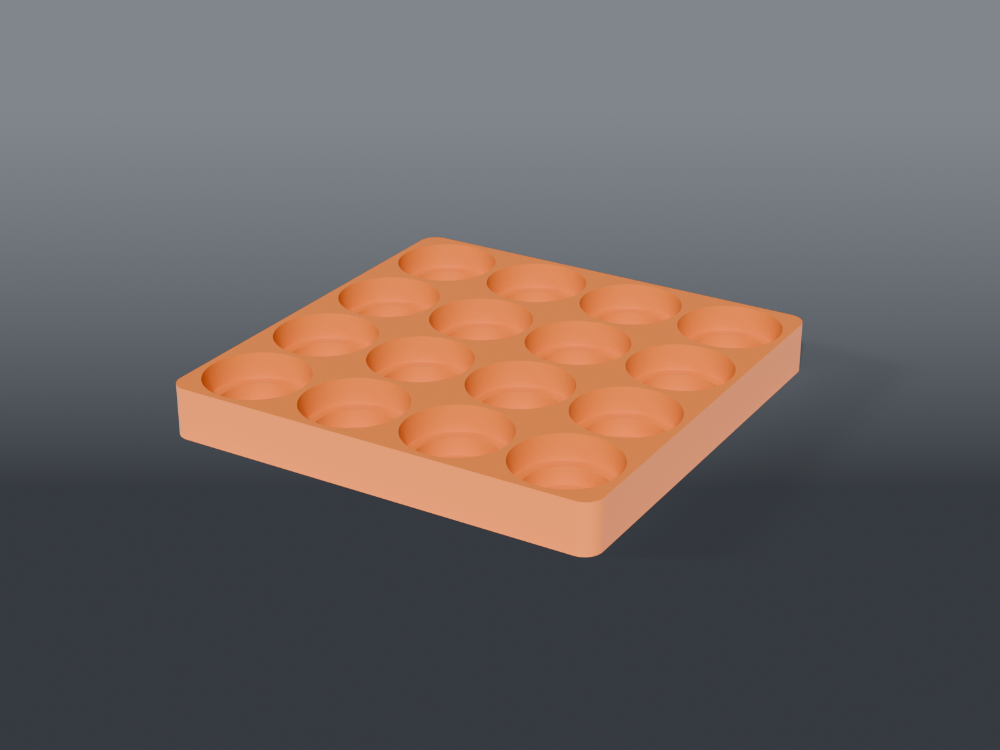

# Concentrate jar tray



A **drop-in tray for 16 concentrate jars**, two sizes in one pocket, sized to a parametric 20×20×4 cm protective case.

**Not Gridfinity** — deliberately standalone, so it travels in the case.

## Parts

| Part | File | Size | Print |
|---|---|---|---|
| **Jar tray** | `tray_jars.scad` | 197.4 × 197.4 × 23 mm | ×1 — floor down, no supports |

454 cm³, roughly 173 g at 15% infill.

## Two sizes, one pocket

Each pocket is a **⌀45.6 recess with a ⌀35.6 bore nested below it**. A wide jar sits on the shoulder; a slim jar drops through and is held by the lower bore.

| jar | rests at | stands proud |
|---|---|---|
| wide ⌀45 | 11 mm (the shoulder) | **14.3 mm** |
| slim ⌀35 | 3 mm (the floor) | **6.3 mm** |

⚠️ **The two sizes cannot sit at the same height.** A slim jar landing in a bore below the wide jar's shoulder ends up lower by exactly that bore's depth — that's inherent to nesting, not a tuning problem. Both stand proud enough to pinch out.

## Why 16 and not 15

**Five across is impossible, and it's the diameter, not the layout.** Five ⌀45.6 pockets need **228 mm** before any wall at all, against a cavity of 199.5. Four is the most that fits on either axis, so the available counts are 4×4 = 16, 4×3 = 12, or 3×3 = 9.

16 beats the 15 originally wanted, in a squarer block, for the same print.

`ROWS = 3` gives **12** and frees a 53 mm strip of the case for a tool or a torch:

```sh
openscad -o tray.stl --export-format binstl -D ROWS=3 tray_jars.scad
```

## The cavity is 199.5, not 200

Rastered off `bottom-20x20x4cm.stl` rather than taken from the model's name: the case's internal cavity measures **199.50 × 199.50**, and the parts export lying on their side, so the depth is on the Y axis.

That extra 9.5 mm over the nominal 190 is what buys **3 mm walls** between pockets. At 190 the same 16 pockets would have needed 1.5 mm.

## Verified on the mesh

- **16 pockets**, single connected body
- both jar sizes seat clear — probed at three pocket positions each, offset off the shoulder and floor planes so coincident faces can't read as a false collision
- **0.0% overhang**, steepest face 0° — nothing to support
- clean on **OpenSCAD 2021.01**

## Recommended print settings

| Setting | Value |
|---|---|
| Material | PETG or PLA — nothing here is load-bearing |
| Layer height | 0.2 mm |
| Walls | 3 |
| Infill | 15% grid |
| Supports | **None** |

It's a big flat part; a brim helps if your first layer is marginal.
