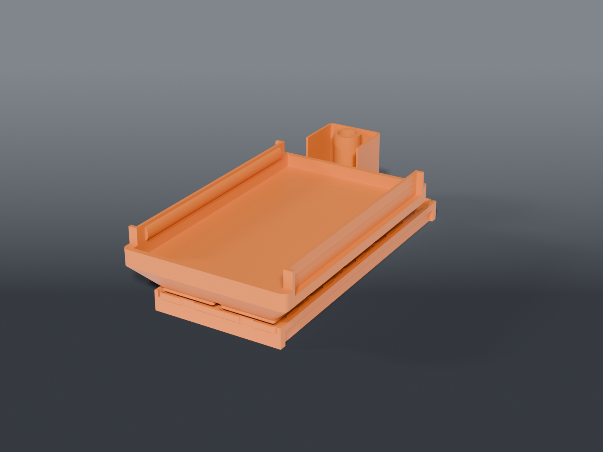

# ENGINDOT Shortkiller topper



A **magnet-free Clickfinity** topper that drops onto the lid of an ENGINDOT bench
supply and holds a **Shortkiller** short-finder where you can actually use it —
displays facing you, buttons reachable, probe and alligator lead in a bucket
behind it instead of tangled across the bench.

Sibling to [`owon-spm8104-tray`](../owon-spm8104-tray/), and the same idea: a
drop-over frame, a Clickfinity plate bonded into it, and bins that click in. The
difference is what the bins carry — that tray holds a spread of barrel adapters,
this one holds one instrument and its leads.

## Parts

| Part | File | Size | Print |
|---|---|---|---|
| **Frame** | `engindot_frame.scad` | 89.6 × 207.65 × 14 mm | ×1 — flat, **walls DOWN** as rendered, no supports |
| **Plate** | `engindot_plate.scad` | 84 × 210 × 4 mm | ×1 — flat, **latches up**, **PETG** |
| **Shortkiller bin** | `bin_shortkiller.scad` | 113 × 180 × 42 mm | ×1 — flat, foot down, no supports |
| **Probe + leads bucket** | `bin_probe_leads.scad` | 41.5 × 41.5 × 42 mm | ×1 — flat, foot down |

Shared dimensions live in `shortkiller_common.scad`.

## How it mounts — no hardware

The frame **drops over the top** of the supply and is held passively:

- **The ledge bears 2 mm on the lid** down both sides → it seats at a fixed
  depth instead of sliding down the skirts. This is the part that is easy to
  leave out; the OWON has 2.15 mm of it, and a revision here that sized the
  ledge off the plate instead of the case ended up with none.
- **Front/back lips** (7 mm) hook the top edges → can't slide fore-aft.
- **Short side skirts** (7 mm) hug the case sides → can't slide sideways.
- **Gravity** does the rest.

The skirts are deliberately short. The ENGINDOT vents the **full height of both
sides**, so the OWON's 20 mm skirt would have sat over the intake. 7 mm is
enough to locate it. `SKIRT_D` takes it lower if you want — but it must stay
equal to `END_LIP_D`, since walls-down they are both bed contact.

**Measured, print-confirmed fits:** lid 80 × 196.85 mm (7¾″). Skirt span 80.0,
lip-to-lip span 197.65. Both verified with `frame_width_gauge` and
`frame_length_gauge` before the frame was cut.

⚠️ `MOUNT_L` is **derived**, not set. The end lips project inward by `END_BAR_T`,
so the clear span is `MOUNT_L − 2×END_BAR_T`. Setting `MOUNT_L` to the case
length gives a span 10 mm too small — that cost two frames.

The top is solid — rear fan only — so a tray over the lid is thermally free.

## The bin is wider and longer than its own foot

The Shortkiller is **98 × 171 mm**. Neither number fits the grid:

- **98 mm wide** needs a 3-cell bin (125.5), but a 3-cell plate is 126 mm on an
  80 mm lid — the plate would hang well off the supply.
- **171 mm long** exceeds a 4-cell foot (167.5), leaving nothing for an end lip
  to stand on.

So the **foot stays 2 × 4 cells** and the **body flares out above it** — sideways
to clear the width, forward to make room for a front lip. Both flares are 45°
ramps that finish below the pocket floor, so they print without support and the
pocket never cuts through a wall that's still narrow. That's what forces the bin
to 6 height units rather than 5.

The forward extension is at the **front only** — a rear one would collide with
the probe bucket.

⚠️ Because the body overhangs its foot, **nothing can sit directly beside this
bin.** On this plate that's fine; on a shared baseplate, leave the neighbouring
cells clear.

## Grip is a spring, not a fit

The pocket is modelled **3 mm oversize** and the side walls are **flexures** —
each relieved on its outer face to leave a 2 mm skin carrying a bump that presses
on the case. Anything within about ±3 mm of the real width still grips, which is
what let this be designed from tape-measure photographs and confirmed with a
coupon rather than calipers.

Both ends carry a **9 mm lip**. The box is operated in place, so they stay low:
the rear clears the DC jack and rocker, the front clears the GX12 connector and
the V+/V− buttons.

## The probe bucket is 1×1 on purpose

The rear row of the plate is two cells, and **one of them stays empty** — the
Shortkiller's DC cord isn't detachable and has to leave the back of the tray
somewhere. Don't fill it.

In use the bucket ended up **between the two supplies** rather than on this
plate: easier to reach, and it keeps a ~160 mm probe down at bench level instead
of standing it up where it fouls anything mounted above. It's a stock 1×1
Gridfinity bin, so it drops into any baseplate — that move cost nothing. Its one
cut-down wall was originally aimed at clearing the Shortkiller's rear panel; sat
between the supplies that low side faces the operator, which is a better reason
than the one it was designed for.

The probe stands **tip-down** in a blind tube so the sharp end is buried in
plastic and you grab the handle. The alligator lead drapes into the well around
the tube. Neither gets unplugged.

The wall facing the Shortkiller is cut down to 13 mm so the bucket doesn't shadow
the box's rear panel.

## Assembly

1. Drop the plate into the frame — it rests on the frame's inner ledge.
2. Run a bead of CA or plastic cement around the seam. One solid unit.
3. Click the bins in. Drop the Shortkiller into its bin from above.

## Clickfinity

Uses the magnet-free [Clickfinity latch generator](https://github.com/IamMrCupp/clickfinity-openscad)
(vendored as `lib/clickfinity.scad`). It holds any standard 42 mm Gridfinity bin
with spring tongues instead of magnets — **print bins in PETG, not PLA.**

## Source

```sh
openscad -o engindot_frame.stl  --export-format binstl engindot_frame.scad
openscad -o engindot_plate.stl  --export-format binstl engindot_plate.scad
openscad -o bin_shortkiller.stl --export-format binstl bin_shortkiller.scad
openscad -o bin_probe_leads.stl --export-format binstl bin_probe_leads.scad
```

⚠️ **Two solids must never meet at exactly the same height.** The feet top out at
`BIN_BASE_H` and the flare above them starts `FUSE` (0.05 mm) lower, on purpose.
Butt them together and the coincident faces leave sliver triangles that read as
non-manifold — and the two OpenSCAD builds this repo has to satisfy disagree
about *which* rounding construction triggers it, in opposite directions:

| construction | OpenSCAD 2021.01 (CI) | OpenSCAD 2026.06 (dev) |
|---|---|---|
| hull of four circles | non-manifold | clean |
| `offset(R) offset(-R)` | clean | non-manifold |

So neither rounding is at fault and chasing `$fn` is a dead end — an earlier
version of this file had a whole `$fn` failure map that was really measuring this.
`lib/gridfinity.scad` had the same bug in its own foot hulls; fixed in #58.

Reproduce CI's exact renderer before blaming a model:

```sh
docker run --rm -v "$PWD":/w -w /w ubuntu:24.04 bash -c \
  'apt-get update -qq && apt-get install -y -qq --no-install-recommends \
   openscad xvfb python3 && xvfb-run -a tools/render.sh'
```

## Test coupons — `coupons/`

Print-first parts, **not** bench parts, so they live in `coupons/` and are left
out of the release. Each answers something a photograph can't — and on this model
that mattered: every lid figure taken from a photo was wrong, and every one taken
from a coupon was right.

| File | Answers |
|---|---|
| `coupons/bin_shortkiller_griptest.scad` | Do the flexures grip at their **real span** — a third of the material, no Gridfinity base |
| `coupons/wrap_test_bands.scad` | Brackets the box height 45/50/55/60 |
| `coupons/frame_width_gauge.scad` | Skirt span against the case — 6 g |
| `coupons/frame_length_gauge.scad` | Lip-to-lip span against the case — 14 g |
| `coupons/shortkiller_fit_gauge.scad` | Staircase gauge, reads a case width without calipers |

## Recommended print settings

| Setting | Value |
|---|---|
| Material | **Plate: PETG** (Clickfinity latches creep in PLA). Bins: PETG. Frame: either. |
| Orientation | Plate flat, latches up. Frame flat, **walls down**. Bins flat, foot down. No supports anywhere. |
| Layer height | 0.2 mm |
| Walls | Plate: Arachne, ≥ 2 loops (thin tongues). Bins: 3+. |
| Cooling | Plate: modest — the tongues need layer bonding. |
| Infill | 15 % |
| Brim | Plate: outer-only, 5 mm, 0.15 mm gap. Frame: mouse ear (bed contact is two thin skirt rails). Bins: none. |

## Fit

Built for the measured unit — **lid 80 × 196.85 mm (7¾″)**, Shortkiller
98 × 171 mm. If yours differs, set `CASE_W` and `CASE_L` for the frame and
`SK_W` / `SK_D` for the bin; everything else derives.

**Set `CASE_W` and `CASE_L` from the case, never the frame dimensions from the
case.** `SKIRT_IN`, `MOUNT_L` and `LEDGE_IN` all derive from them, and asserts
catch a span that cannot fit or a ledge with no bearing.
