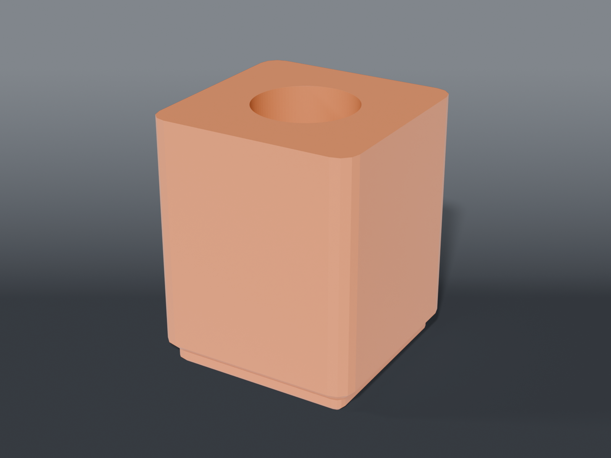

# Engraver station



Gridfinity storage for the **small engraver rotary tool** — not the HARDELL.

> ⚠️ **This is a different tool from `rotary-tool-station/`, and none of its numbers transfer.**
> That directory is HARDELL-only: its own body numbers, cord slot,
> and a bit count taken from a 69-piece set. Different body, different length, different
> accessories. The two were briefly conflated and this tool's gauge reading nearly got written
> into the HARDELL's bit block — which would have recalibrated a part nobody had measured for.

## Parts

| File | What | Size |
|---|---|---|
| `bin_bits_engraver.scad` | 1 × 1 block, 7 × 5 grid, 35 bit holes | 42 × 42 × 24 mm |
| `bin_tool_engraver.scad` | 1 × 1 cup, tool vertical (⌀19.66 bore) | 42 × 42 × 51 mm |
| `bin_accessories_engraver.scad` | 2 × 1 bin — bit box, wheels, spare bay | 84 × 42 × 21 mm |

## The bore is measured, not derived

`BIT_BORE = 2.70`. That's a **gauge reading**, taken 2026-08-25 with
`../rotary-tool-station/coupons/bit_fit_gauge.scad` — five holes at 2.5 / 2.6 / 2.7 / 2.8 / 2.9,
each engraved with its modelled diameter. The engraver's bits go into the **2.7**. The 2.6 does
not take them, so 2.70 is the smallest that works.

The block is cut to 2.70 with `clr = 0`, and that zero is deliberate rather than reckless: **the
clearance is already inside the 2.70.** A finished-hole reading folds the shank diameter and this
printer's hole shrinkage into one number. Adding a nominal clearance on top would double-count it.

**This is why the block exists while the tool cup doesn't.** A drilled block only ever needed the
finished hole, so the engraver's collet size stays unmeasured and stays irrelevant *here*. Calipers
on a bit would have given half the answer and left the shrinkage unknown.

Re-run the coupon and update `BIT_BORE` if the nozzle, filament or layer height changes — the
number is as much a property of the printer as of the tool.

## 35 holes

Counted, not estimated: **35** bits. 7 × 5 at a 6.0 × 8.4 mm pitch fits a 1×1 with 3.3 mm of
material between bores. `BIT_COLS` / `BIT_ROWS` are parametric and an assert fires if the grid
ever drops below `BIT_COUNT`.

## The cup arrived by being mislabelled

`bin_tool_engraver.scad` moved here from `rotary-tool-station/bin_tool.scad` on 2026-08-25. It had
carried the HARDELL's name and a ⌀19.66 bore for months — but the HARDELL measures **28 at the
base tapering to ≈30**, so 19.66 was never it. It matches this tool's ~20 mm across to within
0.34 mm.

The part was always correct; only the label was wrong, so it moved rather than being rebuilt. Had
it been printed under the old name it would simply not have taken the HARDELL, and **no mesh
check, assert, or CI job could have caught that** — it was watertight, manifold, and exactly the
size it claimed to be. Only a caliper on the right tool finds this.

`TOOL_L = 131.36` came with it and is re-attributed on the same reasoning: recorded beside the
19.66 in one session. That's inference, not a reading.

> 🔎 **One check settles it.** Put a tape on this tool end to end. **≈131 confirms** both numbers;
> anything else and the pair needs splitting.

## Source

```sh
openscad -o bin_bits_engraver.stl --export-format binstl bin_bits_engraver.scad
```

## The accessories bin

`bin_bits_engraver` is a drilled block and only takes shank-mounted pieces. The box and the wheels
aren't that.

| Zone | Width | Holds |
|---|---|---|
| Box | 14 mm | the 13 × 13 bit box (1 off) |
| Wheels | 26 mm | ⌀25 wheels, stacked flat |
| Bay | 37.1 × 39.1 | spare |

15 mm deep, full depth in Y.

## Recommended print settings

| | |
|---|---|
| Material | PLA or PETG |
| Layer height | 0.2 mm |
| Walls | 3 perimeters |
| Infill | 15 % |
| Supports | **None** — the bores are vertical |
