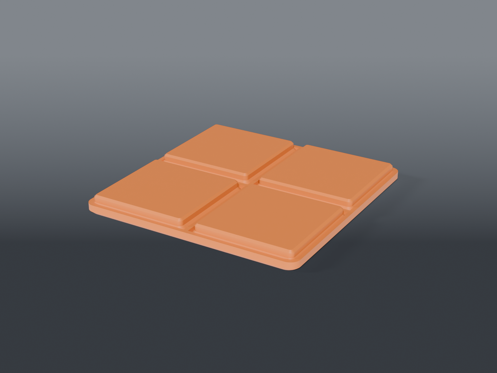

# Gridfinity filler tiles



Flat lids for empty grid. A run of unused cells becomes a working surface — mouse, drink, wrist rest, somewhere to set a board down — and goes back to being storage the moment you lift the tile out.

Parametric from **1×1 to 6×6**, in three tops.

## Variants

| File | Top | Height | Use |
|---|---|---|---|
| `filler_flat.scad` | flat | 6.35 mm | the default — mouse, general surface |
| `filler_coaster.scad` | 2 mm dish, 6 mm rim | 7.95 mm | drinks; a flat tile just spreads the ring |
| `filler_mousepad.scad` | recess for a cut pad | 7.95 mm | bare PETG works under an optical mouse but isn't good |

## Size it from the command line

No file editing — `-D` overrides any parameter:

```sh
openscad -o filler_3x2.stl --export-format binstl -D NX=3 -D NY=2 filler_flat.scad
```

Any size from 1×1 to 6×6. All 36 combinations are render-validated in CI via `lib/selftest.scad`.

## Two things that decide this design

**Feet go in the corners only — never every cell.** Each Clickfinity cell grips with about **12.2 N** (4 arms × 3.04 N). Put a foot in every cell of a 6×6 and removing it takes **~438 N — 45 kgf**. That isn't a tile, it's a permanent fixture, and you'd break the arms or the tile getting it off. Four corner feet cap the release force at **~49 N (5 kgf) at any tile size**: firm enough not to wander, light enough to lift by hand.

**Ribs carry the middle.** With only corner feet a big tile would sag, so the underside drops ribs onto the plate's grid walls. They bear; they don't latch. Rib depth is exactly how far a bin stands proud of that plate.

## Which plate are you on?

`PLATE_TOP` is the plate's top surface above its socket floor, and it is **not** the same for every baseplate:

| Plate | `PLATE_TOP` |
|---|---|
| **Clickfinity shallow** (4.00 mm plate, 1.20 floor) | **2.80** ← default, this bench |
| Standard full-depth Gridfinity (5.85 mm) | 4.65 |

Get it wrong and the ribs either float — the tile flexes underfoot — or hold the feet clear of the sockets, so it rocks and never latches.

## Print

**`filler_flat` prints upside down** and the file already flips it. Every foot surface then tapers inward going up, so the part is fully self-supporting with **no overhangs at all**, and the working surface comes off the build plate glass-flat instead of as top solid infill. That's the difference between a good mouse surface and a mediocre one.

**`filler_coaster` and `filler_mousepad` print top-up** — the dish would need supports inverted, and their surface finish doesn't matter the same way.

| Setting | Value |
|---|---|
| Material | PETG or PLA — carries no load and isn't a spring |
| Orientation | flat: **upside down** (pre-flipped). Coaster/mousepad: top up |
| Layer height | 0.2 mm |
| Walls | 3+ |
| Infill | 15 % — the tile is already hollow with ribs |
| Supports | **None**, all three |

Skin and ribs are **1.6 mm** — four 0.4 mm lines, so they stay pure perimeter. Thicker and the slicer fills them solid, which is how a "hollow" part ends up using more plastic than a solid one.

## Removal

Lift from a corner. The outer top edge is chamfered 1 mm, which kills the trip lip against bare grid and gives a fingernail somewhere to start.
