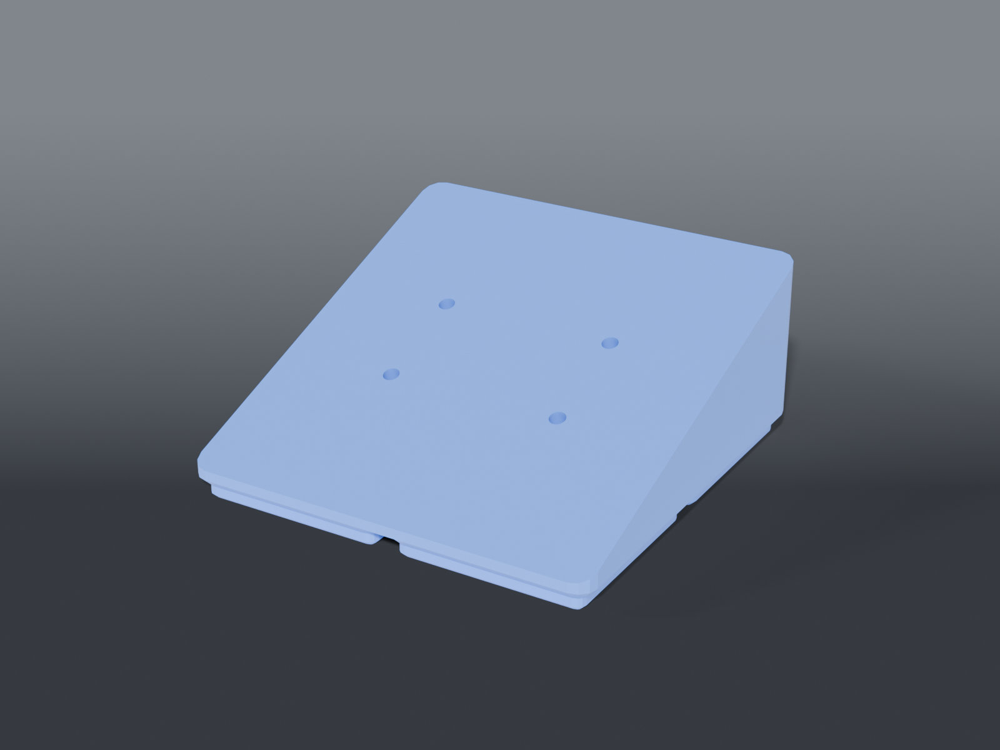

# Heat gun holder



**Gridfinity** 2×2 plate that the heat gun's magnetic bracket screws down onto **on a 20° ramp**, putting the gun
on the grid instead of loose on the bench.

## It bolts from below

The bracket takes screws only from its underside, so they come **up through the plate** into the
bracket's own threads — not down into the plastic.

That inverts the whole plate. v1.0.x had four blind 2.22 mm pilots 10 mm deep in a 12 mm deck:

| | v1.0.x | now |
|---|---|---|
| Holes | blind, 2.22 pilot | **through, 3.24 clearance** |
| Screw head | on top of the bracket | **recessed 4 mm into the foot** |
| Deck | 12 mm | **5 mm** |
| Plate height | 16.75 mm | **6.75 mm at the low edge, 37.14 at the high** |

A pilot would bind the shank, and a head left proud on the underside holds the plate off the grid
so the latch never seats.

## The 20° ramp

Parked flat, the gun's auto-off only fired about **45% of the time**. Tilting it lets gravity
settle the gun into the cradle instead of leaving it balanced on the magnet. 20°, nozzle end
down — the user's call on both.

**The rise runs across the 21 mm spacing, not the 36.** The two screws that are 36 mm apart sit at
the *same* height — that side stays level — and the ramp climbs from one 21 mm row to the other.

⚠️ **`v2.1.0` shipped this the wrong way round** and tilted the bracket about the wrong axis. If you
printed that one, it does not sit right; reprint.

Only the *sign* is free: a Gridfinity plate spins 180° on the grid, so the ramp is cut rising along
+Y and you park the plate with the nozzle at the low end.

Three things follow from tilting a bolt-from-below plate, and all three are easy to miss:

**The screws must be normal to the ramp.** Vertical bores would meet the bracket's threads at 20°
and cross-thread. Both the shank bore and the head counterbore run along the tilted axis.

**36 mm is measured on the bracket, which is now tilted.** Centre-to-centre along the bracket's
own face foreshortens in plan to 36·cos20 = **33.83**. Drill at 36 apart in plan and the holes end
up 38.3 mm apart along the ramp, and the bracket doesn't sit on them.

**The counterbore is what keeps the screw short.** Left solid, a screw entering the underside
crosses **20.0 mm** at the low hole and **33.1 mm** at the high one — two different lengths, both
long, defeating the whole reason the deck was thinned. Cutting the head counterbore along the same
tilted axis, from the bottom face up to `DECK` below the ramp, means the screw crosses `DECK` and
nothing more **at both holes**. Same 10 mm screw as the flat version.

Set `TILT = 0` and you get the flat plate back.

```sh
openscad -o p.stl --export-format binstl -D TILT=0 plate_heat_gun.scad
```

## The deck is sized by screw reach

This is the part that's easy to get wrong. A screw entering from below has to cross the deck
before it reaches the bracket — and with the counterbore doing its job, that is now `DECK` exactly,
at both holes, regardless of tilt.

| Deck | Screw crosses | Needs a screw of |
|---|---|---|
| 8 mm | 8 | 12 mm+ |
| 6 mm | 6 | 10 mm+ |
| **5 mm** | **5** | **9 mm+** |
| 4 mm | 4 | 8 mm+ |

**Measure your screws and pick the row.** Override without editing:

```sh
openscad -o p.stl --export-format binstl -D DECK=6 plate_heat_gun.scad
```

`RAMP_LOW` is a separate knob — it's only how much plastic sits under the ramp's thin end, and it
is not what a screw crosses. Dropping it from 5 to 2 saves 21 cm³.

## What it costs

| | flat | 20° ramp |
|---|---|---|
| Height | 6.75 mm | 6.75 → **37.14 mm** |
| Model volume | 40.8 cm³ | **143.2 cm³** |
| Rough print mass | ~18 g | **~64 g** |
| Overhang steeper than 50° | 293.2 mm² | **293.2 mm² — identical** |

The ramp is solid, so it's a real jump in filament. It adds **no** steep overhang though — the
16.7% / 11.7% figures are the Gridfinity foot's 45° chamfers, which every bin in this repo has and
which print unaided. Supports stay off.

**Measured:** the hole pattern (36 × 21 centre to centre, a true rectangle) and the screw's
2.84 mm thread OD.

> ⚠️ **Not measured: the screw heads.** `HEAD_D = 8.0` and `HEAD_H = 4.0` are set **generously on
> purpose.** An oversized recess loses a little material; an undersized one holds the plate off
> the grid and the latch never seats. Wrong in the safe direction.

> ⚠️ **Not measured: screw length** — and it matters more now than it did. Too short and it never
> reaches the bracket; too long and it bottoms out inside the bracket before the plate pulls
> tight, which feels like a loose bracket rather than a wrong screw.

## Why 2×2 and not 2×1

The hole pattern is only 36 × 21, which a 2×1 would take. But Clickfinity holds about 12.2 N per
cell — a 2×1 is ~24 N (2.5 kgf), a 2×2 is ~49 N (5 kgf). Pulling a heat gun off a magnetic
bracket beats 2.5 kgf easily, and then the plate lifts with the gun.

## Recommended print settings

| | |
|---|---|
| Material | PETG — screws into PLA creep and loosen |
| Layer height | 0.2 mm |
| Walls | 4 perimeters — the bosses take the thread |
| Infill | 30 % around the screw bosses |
| Supports | **None** |
