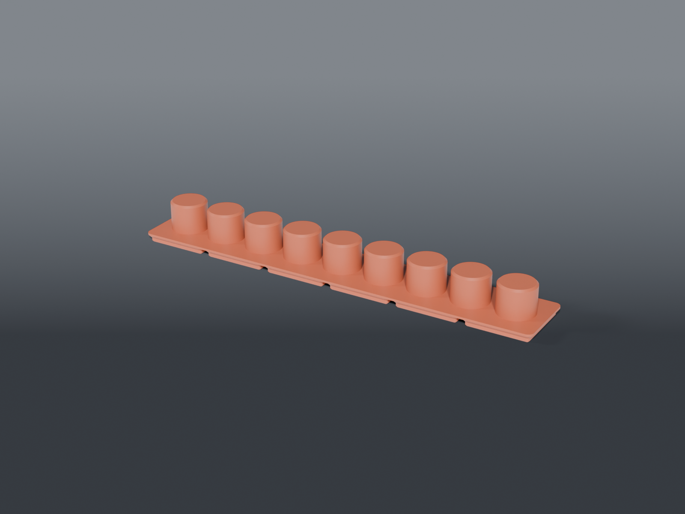

# Hot air nozzle rack

A 6×1 strip of nine posts for the rework wand's nozzles, sized to sit along the iron bench.

## Nozzles sit tip-up, collar down over a post

The nozzles are **split band clamps** — a ⌀22.69 band that squeezes onto the wand, with two folded ears, a screw and a nut projecting on one side.

Only the **band is common to all ten**. The tip sections below it are different lengths and some are offset, so nothing here depends on tip geometry: inverted, the tips stand in free air above the rack where they foul nothing. Tip-down would drive them into the base and the bent ones would not seat at all.

## Measured

Calipered 2026-09-07.

| | |
|---|---|
| band ID | **22.69 mm** — the post is sized to this |
| band OD | 23.95 mm |
| across the nut | 27.11 mm — the ears stand 3.16 mm proud on one side |
| band section | ~23 mm — the common part; the post engages here |
| count | 10 |

## ⚠️ Point the ears across the row

Front or back, not along the strip. This is not tidiness — it is what makes nine fit:

| | pitch | posts on a 6×1 |
|---|---|---|
| ears **across** the row | on the 23.95 band | **9** |
| ears **along** the row | on the 27.11 nut | 8 — and two adjacent nozzles turned inward collide (30.27 > 26.95) |

Nine covers ten nozzles because one is on the wand. A 1-deep row is 39.1 mm interior and the 27.11 envelope crosses it with 12 mm to spare, so pointing the ears across costs nothing.

## Why 6×1

6×1 is 251.5 mm — the longest single strip the 270 mm bed takes. A 7×1 would hold all ten but is 293.5 mm and will not print.

Nine posts at 26.95 pitch span 215.6 mm of a 249.1 mm interior, leaving 16.8 mm of margin at each end, and 3.00 mm of clear air between seated nozzle bands.

## Mass

~145 g, and **that is the grid foot, not slab that could be removed**. `BASE_H` is 6, as thin as it goes: `BIN_BASE_H` is 4.75, leaving a 1.25 mm slab above it. Shelling the base gains nothing — at this height the foot plus any sane floor already exceeds it, so there is no cavity to hollow. Fewer cells or a non-gridfinity base are the only real levers.

## Parts

| file | what |
|---|---|
| `nozzle_rack_common.scad` | measured nozzle dimensions, pitch, layout |
| `nozzle_rack.scad` | the 6×1 strip — 251.5 × 41.5 × 24 mm, ~145 g |

Prints feet down as emitted. No supports — the posts are plain cylinders on a flat base.
