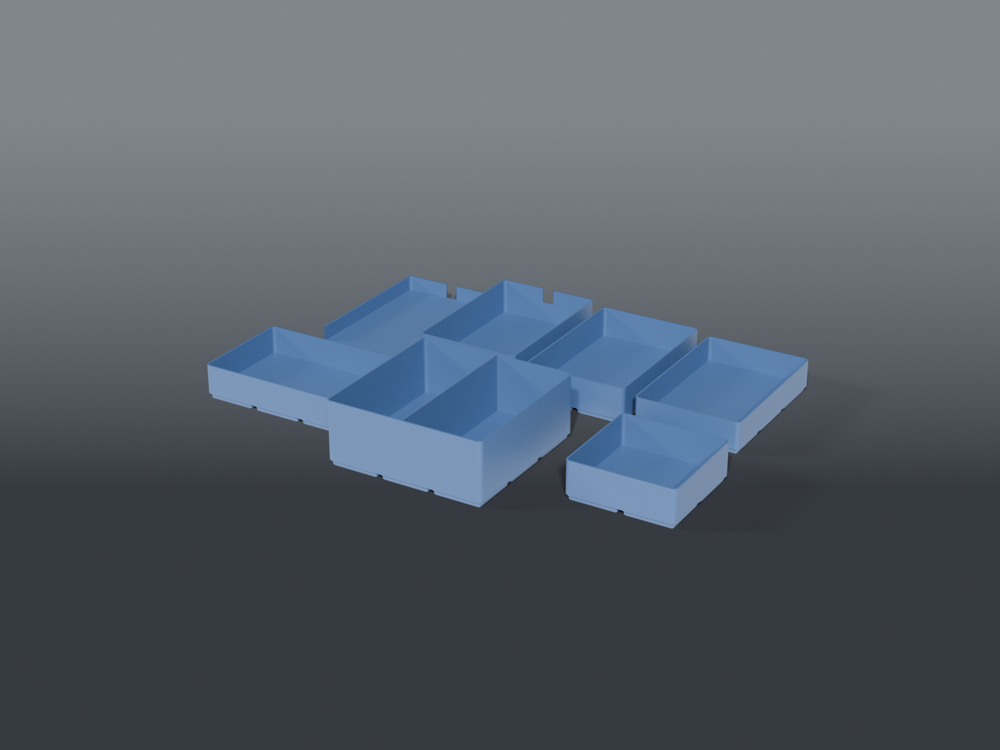

# Instrument holders

Gridfinity docks and accessory bins for three bench instruments — a **DSLogic Plus**
logic analyzer, an **XGecu T48** programmer, and a **FNIRSI LCR-P1** component
tester — plus the kit that comes with each.

These are **docks, not storage**. The DSLogic and the T48 keep USB leads run
permanently to the computer, so their bins have a notch in the rear wall and the
cable dresses away. Nothing coils up inside.

## Parts

| Part | File | Size | Print |
|---|---|---|---|
| **DSLogic dock** | `bin_dslogic.scad` | 2×3, 18 mm | ×1 — **open front**, rear cord notch |
| **T48 dock** | `bin_t48.scad` | 2×3, 34 mm | ×1 — rear cord notch |
| **T48 adapter pocket** | `bin_t48_adapters.scad` | 2×3, 30 mm | ×1 |
| **LCR-P1 dock** | `bin_lcr_p1.scad` | 2×3, 26 mm | ×1 |
| **T48 tool bin** | `bin_t48_tools.scad` | 3×2, 28 mm | ×1 — extractors + ribbon adapter |
| **DSLogic kit bin** | `bin_dslogic_kit.scad` | 3×3, 51 mm | ×1 — **divided**, harness + clips |
| **LCR-P1 kit bin** | `bin_lcr_p1_kit.scad` | 2×2, 31 mm | ×1 |

All flat, foot down, no supports. Shared numbers live in
`instrument_holders_common.scad`. **43 cells** for the set.

## What it holds

| Instrument | Measured | Bin |
|---|---|---|
| DSLogic Plus | 74 × 79 × 9 | 2×3 |
| XGecu T48 | 66 × 107 × 37 | 2×3 |
| T48 adapter block *(in its foam)* | 73 × 103 × 30 | 2×3 |
| FNIRSI LCR-P1 | 65 × 87 × 27 | 2×3 |

## Why every body bin is 2×3

Not the tightest packing available, and that's the point — the brief was breathing
room. It killed two workarounds at once: a flared 2×2 for the LCR-P1 (87 mm over an
83.5 mm foot), and a 1 mm-per-side squeeze on the DSLogic. One footprint across four
instruments also means the docks are **interchangeable on the grid**; you can
rearrange the row without re-cutting anything.

## The DSLogic gets an open front, and it's doing two jobs

Its probe connectors are on the **front face**. A full front wall would turn a dock
into a storage box — you'd lift the pod out every time you wanted to plug the harness
in. Opening the front also solves removal: at **9 mm** the pod is a slab, and a slab
at the bottom of a closed well has nothing to pinch. It slides out forward instead.

⚠️ `open_front_bin()` in the common file makes that opening by **hulling the cavity
profile with a copy of itself**, the same way `lib/gridfinity.scad`'s `_stack_pocket`
does. That is not stylistic. Cutting a front with a second solid puts the cutter's
side walls exactly onto the cavity's own walls, and coincident walls are what leave
the sliver triangles documented on `_bin_foot`. Sweeping one profile means there is
only ever one wall to be on.

It lives here rather than in `lib/` because the repo's rule is that a shared module
earns its place at **two** consumers. Promote it when a second model wants one.

## The cord notch is a strain relief, not just a hole

Cut deliberately **narrower than a USB overmould**: the cable feeds down into the
slot, and the connector then can't pull back through. A sideways tug lands on the bin
rather than dragging the instrument around its pocket — which matters most for the
DSLogic, 9 mm tall and almost weightless.

⚠️ `NOTCH_W = 10` is **unconfirmed** — no cable was measured. It passes a typical
USB-A/C lead and stops its overmould. Widen it if a cable won't seat.

## No card file

Phase 2 originally had the T48's adapters going into a `lib/cardfile.scad` with a
per-card pitch. They don't need one: they live in a **foam block that already indexes
and protects them**, and it lifts out as a single piece — measured as a unit at
73 × 103 × 30. The pocket is plain.

That leaves the BGA stencils as `cardfile`'s only prospective consumer, which is worth
revisiting before that module gets written.

## The DSLogic kit bin is divided, and that's the whole point

In one undivided 9-cell well the grabber clips sink under the flying-lead harness and
you fish for them. Two columns: harness coils in one, clips stay findable in the
other. It's also the deepest bin here at 51 mm — coiled wire wants volume, not floor
area. The harness was always the real storage problem, not the pod.

## Recommended print settings

| Setting | Value |
|---|---|
| Material | PETG (Clickfinity latches creep in PLA) |
| Orientation | Flat, foot down, as exported. No supports anywhere |
| Layer height | 0.2 mm |
| Walls | 3+ |
| Infill | 15 % |

## Fit

Built for the measured units above. If yours differ, every dimension is a named
constant in `instrument_holders_common.scad` — bin heights are `H_*`, and the notch is
`NOTCH_W` / `NOTCH_D`.

**Set bin footprints from the instrument, not from a tidy cell count.** The T48 spent a
while believed to need a flared body on a width reading of 88.69 mm that turned out to
be 22 mm wrong. A footprint that lands suspiciously near a cell boundary deserves a
re-read before it drives geometry.
