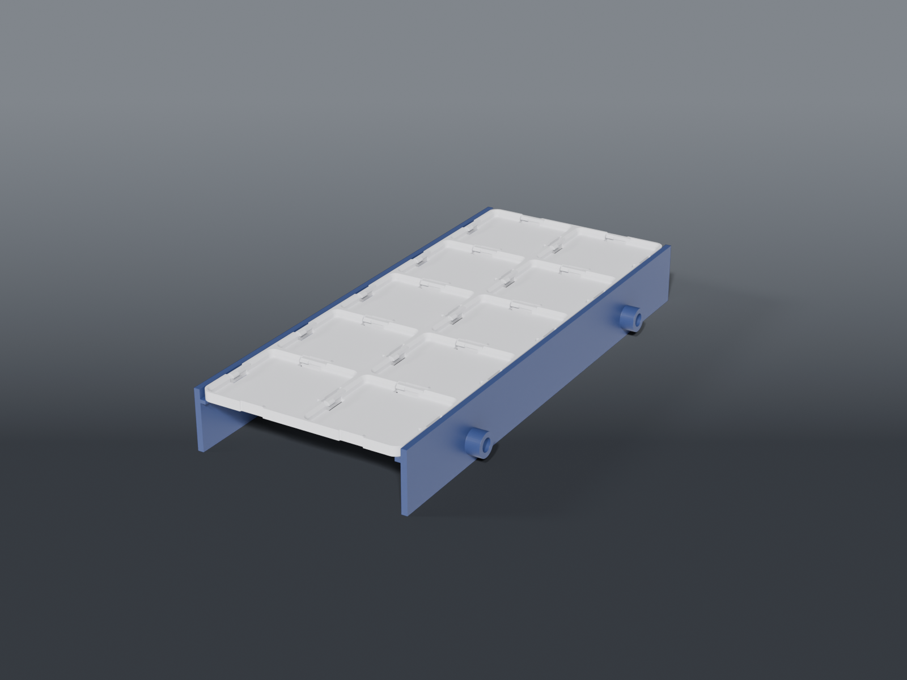

# OWON SPM8104 top tray



A **magnet-free Clickfinity** tray that clamps onto the top of an [OWON SPM8104](https://www.owon.com.hk/) power-supply/DMM, so the mains cord and a spread of barrel adapters live on top of the unit instead of loose on the bench. Ten cells, 4 mm tall, and it lifts straight off when you back the screws out — nothing pierces the tray, nothing sticks to the instrument.

The SPM8104's top vents nowhere (rear fan only), so a solid plate over the lid is thermally free. A nice measured surprise: the datasheet says 82 mm wide, but the real lid is **84.30 mm** — which is *exactly* a 2-cell Clickfinity plate (84.00 mm), so it sits flush.

## Parts

| Part | File | Size | Print |
|---|---|---|---|
| **Tray** | `owon_tray_plate.scad` | 84 × 210 × 4 mm | ×1 — flat, latches up, **PETG** |
| **Clamp rail** | `owon_tray_rail.scad` | 11 × 210 × 25.5 mm | ×2 — on the outer face, PETG or PLA |

Shared dimensions live in `owon_tray_common.scad`. The tray is a stock 2×5 Clickfinity baseplate — the rails don't modify it, so you can reprint a different size later and reuse the rails.

## Why two parts

The tray must print **latches-up** (that's what makes the Clickfinity spring tongues print solid). The clamp skirts point **down** the case sides. Opposite orientations — so they're separate parts, each printed in its best position, screwed together at assembly. No unsupported bridges.

## Why a screw clamp (not a snap-on)

PETG creeps under sustained tension: a spring clamp is tight in week one and loose by month three — the exact failure the Clickfinity latch was designed around. A screw is a positive grip with **no standing load**, and it absorbs the slop between a datasheet number and your actual case.

## Hardware

- **4× M4 brass heat-set inserts** (one per boss)
- **4× M4 machine screws**, ~16–20 mm
- **4× rubber/felt dots** for the screw tips (optional — protects the case finish)

## Assembly

1. Heat an M4 insert into each of the four rail bosses, from the **outer** face.
2. Thread an M4 screw through each; stick a felt dot on the tip.
3. Back the screws out, set the tray on the lid, drop the two rails over the tray's side edges (the plate rests on the inner lip, captured by the upstand).
4. Snug all four screws evenly to center the unit and clamp the case.

## Fit — verify before printing the tray

The rails carry the two unknowns; **print the pair first** (~30 min) and check them on the unit before committing ~3 h to the tray:

- **Side vents.** Skirts drop 20 mm. If your unit's side vent slots start higher than ~25 mm from the top edge, shorten `SKIRT_D` in `owon_tray_common.scad`.
- **Case width.** Built for the measured 84.30 mm with 0.2 mm/side slack. If yours is tighter, bump `CASE_CLR`.
- **Insert diameter.** `HS_D` defaults to 5.60 mm (common M4 heat-set). Verify against your inserts and adjust — too big spins, too small won't seat square.

## Clickfinity

The tray uses the magnet-free [Clickfinity latch generator](https://github.com/IamMrCupp/clickfinity-openscad) (vendored as `lib/clickfinity.scad`). It holds any standard 42 mm Gridfinity bin with spring tongues instead of magnets — **print bins in PETG, not PLA.**

## Source

```sh
openscad -o owon_tray_plate.stl --export-format binstl owon_tray_plate.scad
openscad -o owon_tray_rail.stl  --export-format binstl owon_tray_rail.scad   # print 2
```

## Recommended print settings

| Setting | Value |
|---|---|
| Material | **Tray: PETG** (Clickfinity latches creep in PLA). Rails: PETG or PLA. |
| Orientation | Tray flat, latches up. Rail on its outer skirt face, lip up. No supports. |
| Layer height | 0.2 mm |
| Walls | Tray: Arachne, ≥ 2 loops (thin tongues). Rails: 3+. |
| Cooling | Tray: modest — the tongues need layer bonding; don't blast overhang/bridge fan. |
| Infill | 15 % (tray) / 20–30 % (rails) |
| Supports | None |
