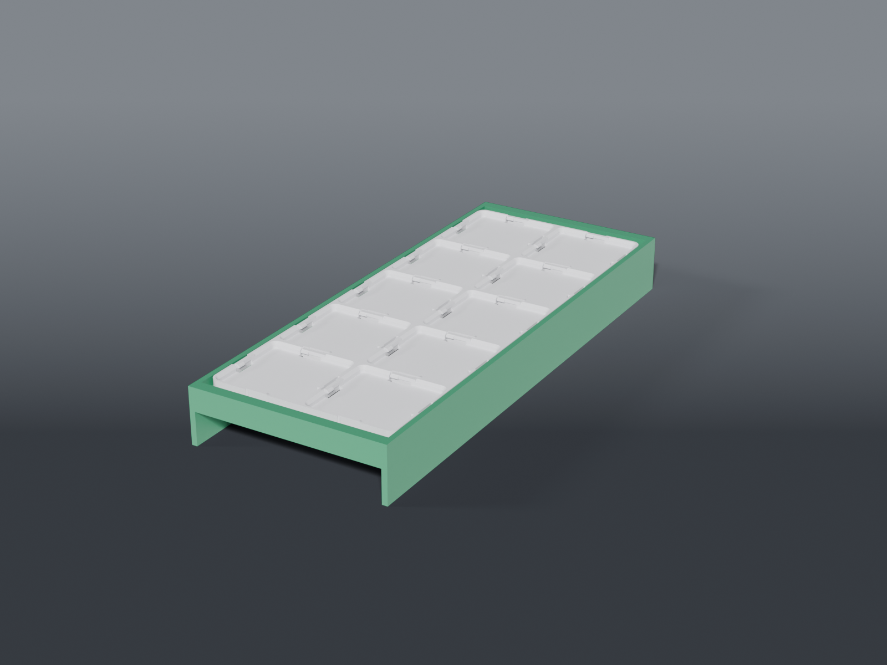

# OWON SPM8104 top tray



A **magnet-free Clickfinity** tray that drops onto the top of an [OWON SPM8104](https://www.owon.com.hk/) power-supply/DMM, so the mains cord and a spread of barrel adapters live on top of the unit in swappable bins instead of loose on the bench. Ten cells, ~4 mm tall, **no hardware** — it drops on and lifts off.

The SPM8104's top vents nowhere (rear fan only), so a tray over the lid is thermally free. A measured surprise: the datasheet says 82 mm wide, but the real lid is **84.30 mm** — exactly a 2-cell Clickfinity plate (84.00 mm), so it sits flush.

## Parts

| Part | File | Size | Print |
|---|---|---|---|
| **Frame** | `owon_tray_frame.scad` | 90 × 237.5 × 25.5 mm | ×1 — flat, walls up, no supports |
| **Plate** | `owon_tray_plate.scad` | 84 × 210 × 4 mm | ×1 — flat, latches up, **PETG** |
| **Fit gauge** | `coupons/owon_fit_gauge.scad` | 91 × 94 × 13 mm | optional — check clearance before committing to the frame |
| **Tip bin** | `owon_bin_tips.scad` | 84 × 126 × 16 mm | ×1 — barrel-adapter tips, standing tip-up |
| **Cord bin** | `owon_bin_cords.scad` | 84 × 84 × 55 mm | ×1 — mains lead, alligator leads, master plug |
| **Cord label** | `owon_bin_cords_label.scad` | 67 × 0.8 × 12 mm | ×1 — reads across the top of the tip block |
| **Tip fit gauge** | `owon_tip_fit_gauge.scad` | 152 × 30 × 12 mm | **print before the tip bin** |

### The two bins fill the plate exactly

The plate is 2 × 5 — ten cells, 84 × 210. A 2×3 tip block (126) plus a 2×2 cord well (84) is
exactly 210, no waste.

**Low bin at the front.** The tip block is ~16 mm; the cord well is 55. Reversed, you'd reach over
a 55 mm wall to pick a 12 mm tip and the well would hide the block entirely. It also gives the
warning label a home: the cord well's front wall stands ~39 mm proud of the tip block, so a label
there reads across the top of it from a normal bench stance.

These are **stock Gridfinity bins** — nothing about them is Clickfinity-specific, so they drop
into either plate type.

**`owon_tip_fit_gauge` is a print-first coupon**, same idea as the rotary tool's. The gauge read a
mix of 12 and 13 on the real tips, which is exactly the kind of thing calipers on a tip won't tell
you.

Shared dimensions live in `owon_tray_common.scad`.

The frame's **clear span is 227.5 mm** — that's the number the case has to fit into, and it's derived from `CASE_L`, not set by hand. The overall 237.5 mm is that span plus an end-bar at each end.

## How it mounts — no hardware

The frame **drops over the top** of the unit and is held passively:

- **Side walls** hug the case sides (20 mm deep, clearing the low side vents) → can't slide off sideways.
- **Shallow front/back lips** (5 mm) hook the top edges, clearing the front display and rear fan → can't slide off lengthwise.
- **Gravity** does the rest — it's a tray of adapters; nothing lifts it.

No clamp, no screws, no inserts. (Earlier revisions had a screw clamp — pointless for this load, and it didn't even work: a screw threaded into a wall can't clamp that same wall.)

## Why two parts

The plate must print **latches-up** so the Clickfinity spring tongues come out solid; the frame walls print **down**. There's no single orientation where both are right, so they print separately. Since the plate is permanent (you swap *bins*, not the plate), just **bond it into the frame** at assembly.

## Assembly

1. Drop the plate into the frame — it rests on the frame's inner ledge.
2. Run a bead of CA or plastic cement around the seam. One solid unit.

## Clickfinity

The tray uses the magnet-free [Clickfinity latch generator](https://github.com/IamMrCupp/clickfinity-openscad) (vendored as `lib/clickfinity.scad`). It holds any standard 42 mm Gridfinity bin with spring tongues instead of magnets — **print bins in PETG, not PLA.**

## Source

```sh
openscad -o owon_tray_frame.stl --export-format binstl owon_tray_frame.scad
openscad -o owon_tray_plate.stl --export-format binstl owon_tray_plate.scad
```

## Recommended print settings

| Setting | Value |
|---|---|
| Material | **Plate: PETG** (Clickfinity latches creep in PLA). Frame: PETG or PLA. |
| Orientation | Plate flat, latches up. Frame flat, walls down. No supports either part. |
| Layer height | 0.2 mm |
| Walls | Plate: Arachne, ≥ 2 loops (thin tongues). Frame: 3+. |
| Cooling | Plate: modest — the tongues need layer bonding; don't blast overhang/bridge fan. |
| Infill | 15 % |
| Supports | None |

## Fit

Built for the measured unit: **84.30 mm** wide, **226 mm** front-to-back across the flat top (rear edge → front bezel), side vents low on the case. Width is confirmed on the real unit; measure your own top length before printing.

Everything is driven by four knobs at the top of `owon_tray_common.scad`:

| Knob | What it sets |
|---|---|
| `CASE_W` | lid width — drives the skirt opening |
| `CASE_L` | lid length — drives the **clear span**, the dimension that has to clear your case |
| `CASE_CLR` / `CASE_L_CLR` | slip clearance across width / length |
| `SKIRT_D` | how far the side walls drop, vs. where your vents start |

`RAIL_LEN` is derived — don't hand-set it. v1.0.3 did, as an *outer* length, which left a clear span 8 mm shorter than the case; the frame perched on the lid instead of dropping over it.

**Print the fit gauge first.** It's five stepped clearances in one short print, in the same filament as the frame, so shrinkage is included in what you measure.
