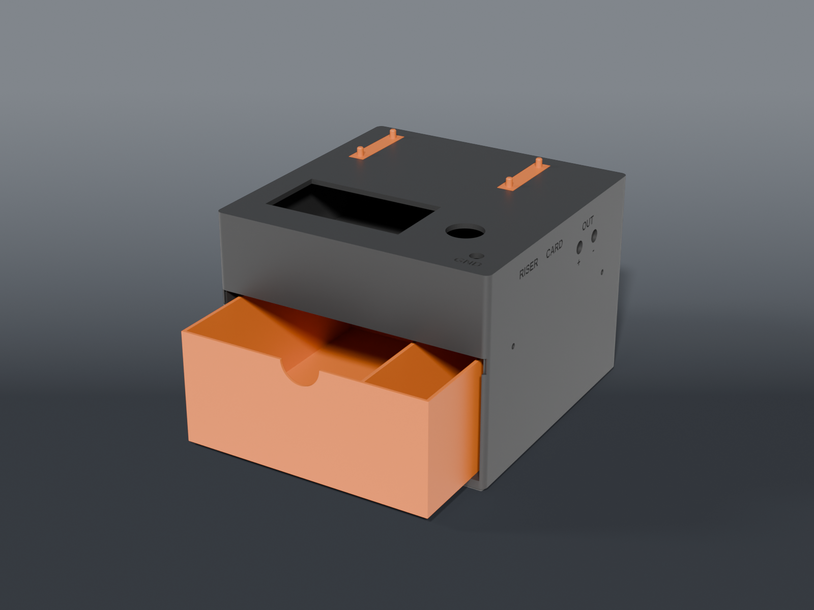

# PCIe test rig — power box

A **fused, switched, metered 12 V feed** for a bench PCIe GPU test rig, in a 4×4 Clickfinity-footed box. Run a card off external 12 V plus the slot, watch it boot, probe the rails. Keyed **XT60** in and out, banana pairs beside them, a probe-ground post on top, and the riser docked on the deck. Two printed parts plus two small rails; four screws open it.

Wiring is its own document: **[WIRING.md](WIRING.md)**, with the KiCad schematic in [`wiring/`](wiring/).

## Parts

| Part | File | Size | Print |
|---|---|---|---|
| **Base** | `rig_base.scad` | 167.5 × 167.5 × 16.75 mm | ×1 — feet down, no supports. 126 cm³ |
| **Cup** | `rig_cup.scad` | 167.5 × 167.5 × 43 mm | ×1 — emitted deck-down, no supports. 139 cm³ |
| **Cup labels** | `rig_cup_inlay.scad` | — | optional second colour — load as a part of the cup, same origin, assign the second filament. 28 letters, 0.2 cm³ |
| **Dock rail** | `rig_dock_rail.scad` | 10 × 47 × 6.4 mm | ×2 — pegs up. 0.7 cm³ each |
| **Deck coupon** | `coupons/deck_coupon.scad` | 140 × 100 × 3 mm | **print first** — every panel hole with a fit ladder, plus a label. 27 cm³ |
| **Rail ladder** | `coupons/dock_rail_ladder.scad` | 52 × 47 × 6.4 mm | **print first** — four rails at four peg sizes. 3 cm³ |
| **Meter + fuse coupon** | `coupons/meter_fuse_coupon.scad` | 98 × 244 × 3 mm | **print second** — three meter frames stepping the long axis, the fuse ladder, the rocker + post at their chosen sizes, and a row of the panel words at full size. All text is on the **bed face**, mirrored, the way the deck's labels print. Four pieces. 27 cm³. `meter_fuse_coupon_inlay.scad` is its second colour |
| **Joint coupon** | `coupons/joint_coupon.scad` | 88 × 40 × 16.75 mm | **print first** — a corner of the base and the matching corner of the cup: skirt fit + screw. Two pieces. 16 cm³ |

About 265 cm³ for the box, all PETG. Assembled it stands 51 mm above the plate's socket floor.

## How it goes together

- **Base.** A footed floor plate with a 1.5 mm tongue standing 9 mm up round its edge and four screw bosses behind it. Latching feet in the four corners only — sixteen would need ~195 N to lift — with ribs bearing on the plate's grid walls between them, the same pattern as the filler tiles. The WAGO ground bus sits on this floor, on its wires.
- **Cup.** Deck plus four walls, open bottom, with its bottom 9 mm thinned into a skirt that wraps the tongue, flush outside. **Every electrical part is on this one piece** — meter, switch and probe post on the deck, XT60, banana input and fuse on the rear wall, XT60 and banana output on the right — so the wiring never crosses a joint. Labels are engraved 0.8 deep, and `rig_cup_inlay.scad` fills them flush in a second colour: the deck's GND is the first four layers on the bed, the wall labels cost a tool change per layer they cross. Prints upside down, deck on the bed, so the cutouts come out in the first layers.
- **Joint.** Four **M3 × 10** screws go in horizontally from outside, through the skirt and tongue, self-tapping into the bosses. The box stays latched to the grid for service: screws out, cup lifts off with its wiring intact. No heat-set inserts.
- **Riser dock.** The x16 board has its slot flush along one edge, capacitors crowding the other and the 6-pin and USB filling an end, so there's no edge to clip. It has four mounting holes on a 99 × 37 pitch instead. Two rails, two pegs each, CA'd into flush pockets on the deck; the board lies on its own foam pad with the pegs through it. Separate parts because a peg can't grow off the face that's on the bed.

Earlier revisions carried a cord drawer underneath — frame, shelf and drawer, another 450 cm³ and 70 mm. The leads live in a parts drawer instead, so it went.

## Layout

| Face | Carries |
|---|---|
| **Top deck** | PZEM-031 meter, 20 mm rocker, probe GND post, riser dock |
| **Rear** | XT60E-M **12V IN** + banana **+ / −** pair, in parallel, and the 5×20 **FUSE** holder (8 A) |
| **Right** | XT60E-F **RISER** and **CARD** (two in parallel behind the one switch; `XT60_OUT_N` makes it one) + banana **OUT + / −** pair |
| **Inside** | the WAGO ground bus, on its wires |

Every position is a named constant in `rig_common.scad`, and the cup asserts that nothing walks into a wall or onto the meter's bezel if you move one.

## Measured, not assumed

Every component number came off calipers on the real part (survey 2026-09-27):

| Part | Measured | Hole in the model |
|---|---|---|
| Ampper rocker | body 20.87, clips relaxed 22.88, 23.3 below deck | `SW_HOLE` **21.3** — fitted on the deck coupon |
| PZEM-031 meter | housing 84.29 × 44.50, 24.45 deep; bezel 89 × 49 | short axis +0.30/side, long axis **+0.75/side** (85.79 — tight snap, clean removal). Both fitted. The first try at +0.30 long nearly broke a clip |
| 4 mm binding post | thread 7.45, 19 long | `POST_HOLE` **7.6** — all three steps passed, tightest wins |
| 5×20 panel fuse holder | thread 11.6, 26 long | `FUSE_HOLE` **11.8** — fitted (tight) |
| XT60E-M / XT60E-F panel connectors | **not yet in hand** | **no cutout** — `XT60_MEASURED = false` gates them; positions are reserved |
| riser x16 board | 126.55 × 43.20, holes ⌀3.98 on 99 × 37, 4.0 thick with its foam | `PEG_D` 3.8 |

Every panel hole except the XT60s has now been fitted on a printed coupon. The XT60 cutouts don't exist in the model until the connectors have been calipered — a plausible number there is exactly how two printed parts got scrapped in August.

## Print order

1. **`coupons/deck_coupon.scad`** — 3 mm plate with the meter cutout, a three-step ladder for the rocker and for the binding post, and an engraved label to judge legibility. Push each part in, note which step fits, set `SW_HOLE` / `POST_HOLE` to match. When the XT60s arrive, caliper them, fill `XT60_*`, flip `XT60_MEASURED`, and the coupon grows an XT60 cutout to check too.
2. **`coupons/dock_rail_ladder.scad`** — four rails at 3.6 / 3.7 / 3.8 / 3.9. Push the riser onto each; set `PEG_D` to the one that holds without a fight. Snap off the two you'll use — they're the real rails.
3. **`coupons/meter_fuse_coupon.scad`** — the deck coupon's follow-up. Pick the tightest meter frame the display goes into without forcing a clip and whose clips still catch; pick the fuse hole that takes the holder. Set `METER_CLR_L` / `FUSE_HOLE`. The rocker and post holes should simply fit.
4. **`coupons/joint_coupon.scad`** — a corner of each big part. Drop the cup corner over the base corner: it should go on by hand and not rattle. Run an M3 × 10 into the pilot: it should bite without splitting the boss. Adjust `JOINT_CLR` / `SCREW_TAP` if not.
5. Then the box: base, cup. The coupons fit a bed together; the base does not fit beside them.

## Verified

- All five parts render **single-body, watertight**, at the sizes in the table
- **`check_assembly.py`** places every part and every component where it lives and renders 15 pairwise intersections: base against cup, meter / switch / posts and their nuts / riser against both, a 2.5 mm rod down every screw axis through both the clearance and the pilot. All empty. (Its first run, on the drawer-bay revision, caught a 1.5 mm lip of the cup's front wall hanging across the opening — 768 mm³ that the per-part checks were happy with.) The XT60 bodies join the check the moment they're measured.
- Clean on **OpenSCAD 2021.01**, what CI runs

## Recommended print settings

| Setting | Value |
|---|---|
| Material | PETG |
| Layer height | 0.2 mm |
| Walls | 3 |
| Infill | 15% gyroid |
| Supports | **None** |

The cup is emitted deck-down. The base is feet-down. Don't flip either.

## License

CC BY-NC 4.0, like the rest of the models here. The wiring schematic and check script are MIT.
