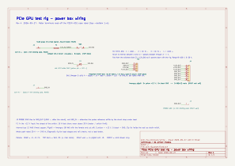

# PCIe test rig — wiring guide

The power box for a bench PCIe GPU test rig: a fused, switched, metered 12 V feed with a keyed output for the card and the riser, and a ground post for your scope or DMM. This guide is the build order and the wire-by-wire list. The schematic it follows is [`wiring/pcie_rig_power.kicad_sch`](wiring/pcie_rig_power.kicad_sch) — open it in KiCad, or read the [PDF](wiring/pcie_rig_power.pdf) / [SVG](wiring/pcie_rig_power.svg).

**What it is, and isn't.** Everything in the path — meter, switch, fuse — is rated 20 A, so this is a ~240 W supply. That's plenty for watching boot stages and checking rails. It is not a load tester; don't run a card flat out through it.

## Parts

| Ref | Part | Where it mounts | Source |
|---|---|---|---|
| **J1, J2** | 4 mm binding posts, red + black — 12 V IN | rear wall | uxcell 10-pack, [B08LN5T9D7](https://www.amazon.com/dp/B08LN5T9D7) |
| **J3** | 4 mm binding post, black — PROBE GND | top deck | same pack |
| **F1** | 5×20 mm panel-mount fuse holder + **15 A fast-blow** glass fuse | rear wall | Gebildet kit, [B07VT4VRW7](https://www.amazon.com/dp/B07VT4VRW7) |
| **SW1** | Ampper 20 mm round rocker, 12 V 20 A, 3-pin, illuminated dot | top deck | [B0BZPY5D9L](https://www.amazon.com/dp/B0BZPY5D9L) |
| **M1** | Peacefair **PZEM-031** — DC 8–100 V / 0–20 A, LCD, built-in shunt | top deck | sold as HiLetgo, [B079JVGRSL](https://www.amazon.com/dp/B079JVGRSL) |
| **J4** | Amangny 8-pin female → 2× 8(6+2) male, 22 cm, 18 AWG — **one cable becomes the pigtail** | exits the right wall | 6-pack, [B094QSRK98](https://www.amazon.com/dp/B094QSRK98) |
| — | Kingwin PCIe 1x→16x riser kit (x16 board, x1 card, USB 3.0 lead, SATA→6-pin) | docks on the top deck / drawer | [B07QBF2X6C](https://www.amazon.com/dp/B07QBF2X6C) |
| — | 12VHPWR 16-pin → 4× 8-pin, for cards with the 16-pin connector | drawer | [B0GYHKK5WS](https://www.amazon.com/dp/B0GYHKK5WS) |

**Wire and consumables:** 12 AWG stranded copper for the internal bus (tinned is nice, not required). Heat-shrink. One zip tie. Ferrules and a crimper, or solder — either is fine at these currents. Four **M3 × 10** screws hold the electronics cup to the footed frame — they self-tap into printed pilots, no inserts. A drop of CA for the two riser dock rails.

## Where things go

| Face | Carries |
|---|---|
| **Rear** | J1 (+, red), J2 (−, black), F1 |
| **Top deck** | SW1, M1, J3, and the riser dock |
| **Right wall** | J4 pigtail exit |
| **Front** | the cord drawer, nothing else |

The top deck is fixed — service access is from the bottom, so nothing that carries current lives on a removable part.

## Wire by wire

Net names match the schematic. Every internal run is 12 AWG unless noted.

| # | From | To | Net | Notes |
|---|---|---|---|---|
| 1 | J1 (red post) | F1, either terminal | `12V_IN` | fuse sits in the + line, ahead of the switch |
| 2 | F1, other terminal | SW1 **A** (supply +) | `12V_IN_FUSED` | |
| 3 | SW1 **B** (load +) | M1 terminal **3** — DC IN + | `12V_SW` | meter self-powers from here, so it sleeps with the rig |
| 4 | J2 (black post) | M1 terminal **2** — DC IN − | `GND_IN` | the shunt is inside M1, between 2 and 1 |
| 5 | SW1 **yellow** pin | `GND_IN` (M1 terminal 2, or J2) | `GND_IN` | LED return; 18 AWG is fine. On the input side so the dot's current stays out of the reading |
| 6 | M1 terminal **4** — LOAD + | pigtail, all **3 yellow** | `+12V_OUT` | |
| 7 | M1 terminal **1** — LOAD − | pigtail, all **5 black** | `GND_OUT` | |
| 8 | M1 terminal **1** — LOAD − | J3 (probe post) | `GND_OUT` | **output** negative, after the shunt — see below |

PZEM-031 terminals, top to bottom as printed on its back: **1 LOAD −, 2 DC IN −, 3 DC IN +, 4 LOAD +.** The + side passes straight through 3 → 4; the shunt sits between 2 and 1.

**Why J3 is the output negative.** The meter measures current by the voltage drop across its internal shunt, and that shunt is in the negative leg. Reference a probe to the *input* negative and your ground floats by the shunt drop every time the card draws current. Tie it to LOAD − and the probe sees exactly what the card sees.

## Build order

1. **Make the pigtail.** Take one Amangny cable and cut the 8-pin *female* end off, leaving the two 8(6+2) males on the other end intact. Strip back the sleeve and separate the bundle: 3 yellow (+12 V), 5 black (GND). Twist and tin each bundle, or ferrule them.
2. **Dry-fit the panel parts** in the printed cup before wiring anything — meter, rocker, fuse holder, three posts. If something doesn't fit, fix the print, not the part.
3. **Feed the pigtail** through the right-wall hole from the outside, males out — both tails go through the one hole, the Y-split stays inside. Leave ~80 mm inside. Cinch a zip tie round both tails just inside the wall — that's the strain relief. Trim the tie's tail.
4. **Wire the rear**: J1 → F1 → SW1 A (rows 1–2). J2 → M1 terminal 2 (row 4).
5. **Wire the top**: SW1 B → M1 terminal 3 (row 3). SW1 yellow → GND_IN (row 5).
6. **Wire the output**: M1 terminal 4 → yellow bundle (row 6). M1 terminal 1 → black bundle *and* J3 (rows 7–8). Heat-shrink every splice.
7. **Leave slack.** For service the four side screws come out and the cup lifts off with the shelf; nothing crosses that joint, but make sure no wire pulls tight against the shelf's edge when it does.
8. **Fuse in, cap on.** 15 A fast-blow.

## Before first power

Do these with the input posts unplugged.

- **Continuity, meter off.** J1 to F1 to SW1 A. With the rocker on: SW1 A to M1 terminal 3. Rocker off: open.
- **Polarity.** Yellow bundle to M1 terminal 4, and *only* terminal 4. Black bundle to M1 terminal 1. J3 to M1 terminal 1.
- **No shorts.** Resistance between the yellow and black bundles reads open. Between J1 and J2 reads open.
- **Check the 6+2 males against the card's pinout diagram** before you ever plug one in — the Amangny colour code is the standard PCIe one (yellow = +12 V, black = GND), but confirm it on the actual connector with a continuity beep.

Then: bench supply set to 12.0 V, current limit low (1 A is plenty), connected to J1/J2, **nothing on the output.** Rocker on — the dot lights and the PZEM-031 wakes up reading ~12 V, 0.00 A. Rocker off — everything dark. Only now does the riser go on.

## Limits

- 20 A end to end. **Fuse at 15 A** and leave it there.
- The meter needs ≥ 8 V to run. Below that it goes dark; the rig still passes power.
- Every downstream connector hangs off the pigtail's three 18 AWG yellows. That's fine at 20 A. It's not fine at 30.

## Files

- [`wiring/pcie_rig_power.kicad_sch`](wiring/pcie_rig_power.kicad_sch) — KiCad 10 schematic, the source. ERC clean with every severity on.
- [`wiring/pcie_rig_power.pdf`](wiring/pcie_rig_power.pdf), [`wiring/pcie_rig_power.svg`](wiring/pcie_rig_power.svg) — renders. Regenerate with `kicad-cli sch export pdf` / `svg`.
