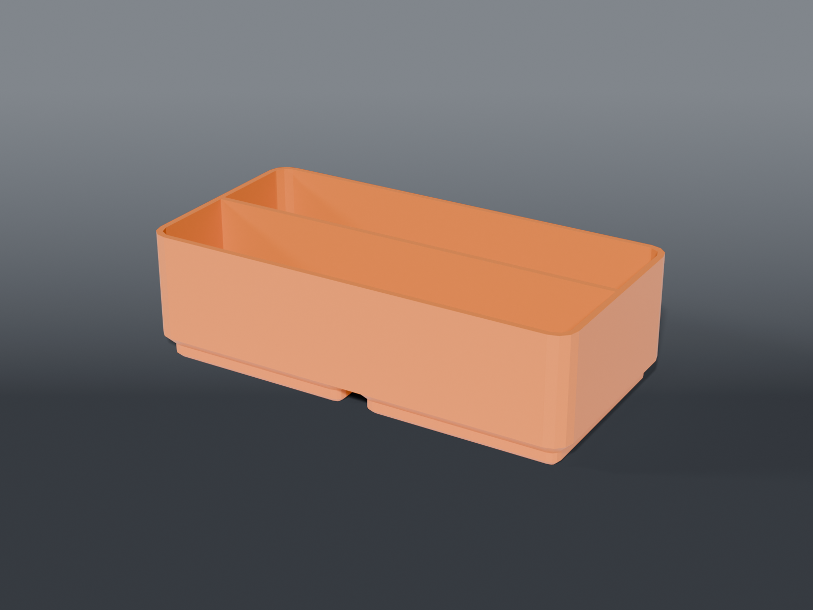

# Phone-repair consumables

A **2×1 bin split down its length into two flat-bottomed bays** — the adhesive/foam roll in one, the loose strips in the other.

## Parts

| Part | File | Size | Print |
|---|---|---|---|
| **Adhesive + foam bin** | `bin_adhesive_foam.scad` | 83.5 × 41.5 × 25 mm | ×1 — feet down, no supports |

Two bays of **81.1 × 18.95**, 18.85 mm floor to rim. 25.8 cm³, about 11 g.

## The roll bridges, it doesn't sit in

⚠️ The roll is **⌀92** against an 81.1 mm bay, so it never reaches the floor. It stands in the slot and rests across the two end walls, proud of the rim — the same arrangement as a tape dispenser.

**What holds it upright is the slot width pinching its faces**, not the floor shape. That's why there's no cradle: a flat floor does the job as well as a curved one once the slot is doing the work.

⌀92 **cannot be contained** by a 2×1 in any orientation. Fully enclosing it needs a 3×3.

## Nothing here is cut from a guessed number

The divider sits at the midline — half the bin each. The roll's **thickness** and the strips' size never enter the geometry, so neither had to be measured.

The one recorded dimension, `ROLL_D = 92`, is measured (Kapton reel outer ⌀, 2026-08-20, core 78.5) and is used only to document why the roll can't be contained. No feature is cut from it.

## Three earlier cuts, and what each got wrong

Kept because the reasoning is the useful part:

| | What it did | Why it was wrong |
|---|---|---|
| **3×2** | trough spanning the bin's full depth | handed 81 mm of depth to a roll ~9 mm thick — that's what made it enormous |
| **2×1 (a)** | trough shrunk to ⌀50 | assumed ⌀92 needed *containing*, judged it impossible, and cut something that fits no roll at all |
| **2×1 (b)** | full-depth saddle at the roll's own radius | cradled it against rolling but left a thin disc free to lean, and it did |

All three came from treating a roll as something to swallow rather than something to stand up.

## Recommended print settings

| Setting | Value |
|---|---|
| Material | PETG |
| Layer height | 0.2 mm |
| Walls | 3 |
| Infill | 15% grid |
| Supports | **None** |
