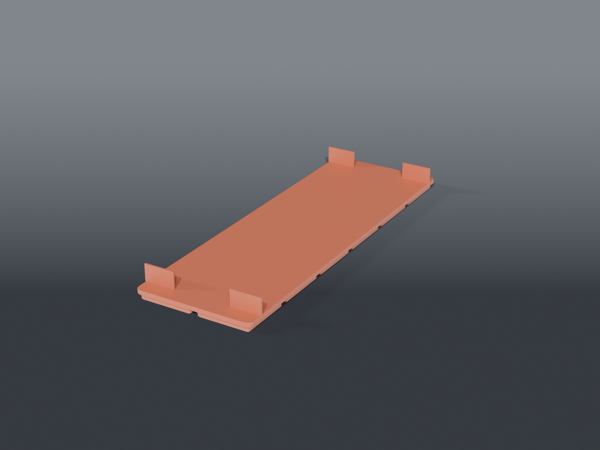

# PSU locators

Corner locators that stop a bench PSU wandering, without boxing it in.

## Corners only, not a tray

Both supplies need their sides open — the ENGINDOT has full-height side vents, and the OWON is about two cells wide flush, so there is nowhere for a side wall to go. Thin corner nubs capture all four corners and leave everything else clear for airflow and cabling.

## Parts

| file | supply | footprint | grid |
|---|---|---|---|
| `owon_locator.scad` | OWON SPM8104 | 84.3 × 226 mm | 2×6 |
| `engindot_locator.scad` | ENGINDOT bench PSU | 80 × 193 mm | 2×5 |
| `psu_locators_common.scad` | shared `psu_locator()` | | |

On the OWON the nubs land front and rear only; the sides stay open.

Prints feet down, no supports.
