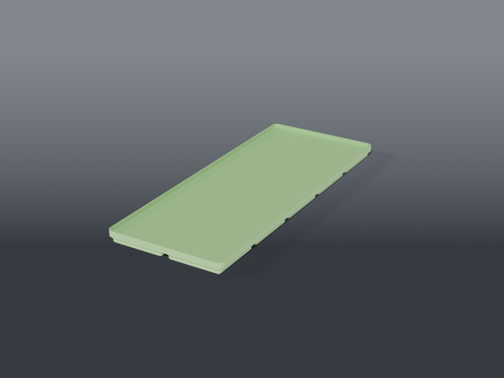

# PSU plates



**Gridfinity** plates for a power supply to stand on. Not bins — the unit sits on top, and the
only wall is a short lip to stop it walking off.

The point is that the PSU stops sliding around on the desk and the footprint it occupies becomes
part of the grid instead of dead space. Standard Gridfinity feet underneath, so they latch into
the same baseplates as everything else.

## Parts

| File | Size |
|---|---|
| `plate_2x5.scad` | 83.5 × 209.5 × 9.2 mm |
| `plate_2x6.scad` | 83.5 × 251.5 × 9.2 mm |

Shared dimensions live in `psu_plate_common.scad`. `LIP` is the number to change — 3 mm by
default, measured above the plate floor, with total height coming out as
`BIN_BASE_H + FLOOR + LIP`.

**The lip is deliberately short.** Tall enough to catch a foot that shifts, short enough not to
foul the PSU's own feet or turn the unit into a lift-out. If your supply has a recessed base or
rubber feet near the edge, drop `LIP` rather than fighting it.

## Source

```sh
openscad -o plate_2x5.stl --export-format binstl plate_2x5.scad
```

## Recommended print settings

| | |
|---|---|
| Material | PLA or PETG |
| Layer height | 0.2 mm |
| Walls | 3 perimeters |
| Infill | 15 % |
| Supports | **None** |
