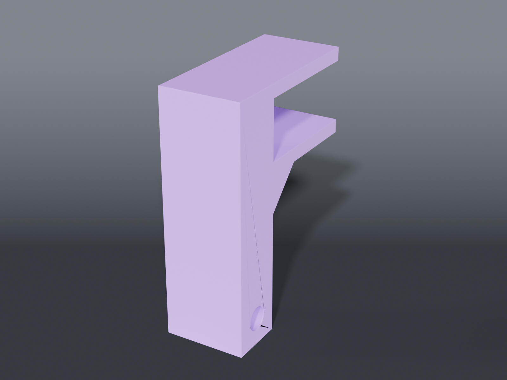

# Reel brackets



Shelf-edge clamps carrying an **8 mm rod** of tape or wire reels. **Print two** — three for a
long span. Not Gridfinity: a 92 mm reel would need a 3×3 on the grid, which is why these hang.

## Why a pair, and why it hooks

**A pair means the rod length never has to be known.** Two ends, any rod between them. An 8 mm
steel rod over 18″ with ~600 g of reels sags 0.19 mm, so two is enough.

**It hooks over the shelf rather than sticking to it** because the load self-tightens the grip:
weight on the rod rotates the bracket about the shelf's front-bottom edge, pulling the top arm
*down* onto the shelf. An adhesive pad does the opposite — the same rotation peels its front
edge, and peel is how pads fail.

## No bearings, no hubs

Reels ride straight on the rod, like a roll on a dowel. The 78.5 mm core rests on the 8 mm rod
and turns; the eccentricity doesn't matter. The core rubbing the rod gives a little drag, which
is **wanted** for wire — a free-spinning spool overruns and birdnests — and harmless for tape.

## Parts

| File | What | Size |
|---|---|---|
| `rod_bracket.scad` | shelf clamp + rod bore | 30 × 65.6 × 90.92 mm |

The spine thickness is **derived from the bore**, never set by hand — at 7 mm against an 8.6 mm
bore the hole cut straight out through both faces and left an open channel a rod would drop out
of. Anything containing a hole is sized from that hole.

## The shelf is measured

`SHELF_T = 21.12 mm`, measured 2026-08-25, giving a **21.92 mm slot** with 0.8 mm of clearance so
it slides on.

It was **12.7 mm (½″) by estimate** until then, and that estimate was wrong by **8.42 mm** — a
slot cut to it would not have gone onto the shelf at all. This part was deliberately held back
from release for exactly that reason: a bracket that doesn't clamp isn't a bracket, and it's not
a dimension a mesh check can catch.

For a different shelf, re-render rather than filing the slot:

```sh
openscad -o rod_bracket.stl --export-format binstl -D SHELF_T=<yours> rod_bracket.scad
```

## Source

```sh
openscad -o rod_bracket.stl --export-format binstl rod_bracket.scad
```

## Recommended print settings

| | |
|---|---|
| Material | PETG |
| Orientation | **Flat face on the bed** — the bore then prints as a vertical hole with no bridge, and layers run across the pull rather than along it |
| Layer height | 0.2 mm |
| Walls | 4 perimeters |
| Infill | 40 % |
| Supports | **None** |
