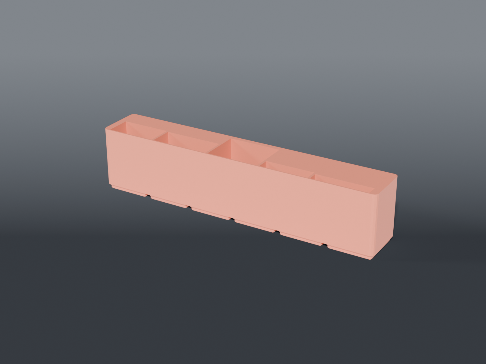

# Remote tray



**Gridfinity** 6×1 tray holding five remotes on end, each in a slot cut to that remote.

## Why slots and not a bin

Five remotes in a shared well fall over each other and you dig for the one you want. The
thinnest here is 8 mm and the thickest 35 — in a common well the thin ones just lie down.

A slot per remote also means each one can only go back where it came from, and the whole row
presents at a single front line rather than staggering.

## Slots

| Remote | Width × thickness | Slot |
|---|---|---|
| Roku | 42 × 21 | 43 × 22 |
| Insignia TV | 50 × 20 | 51 × 21 |
| LG 4K TV | 45 × 35 | 46 × 36 |
| Microscope cam | 41 × 10 | 42 × 11 |
| Fume extractor | 48 × 8 | 49 × 9 |

Front-aligned, 2 mm dividers, 5 mm margin each end. Add or reorder by editing the `REMOTES`
list — widths and positions are computed from it, and an assert fires if they no longer fit.

## Two numbers that constrain this

**6×1 is the only size that works.** The slots total 226 mm; with clearance and walls that's 243
against a 6×1's 249.1 mm interior. A 7×1 would be 293.5 mm and **exceeds the 270 mm bed**.

**Dividers are 2 mm, not the usual 3.** At 3 mm it needs 249.0 of the 249.1 available — that is
not a fit, it is a coincidence.

## Capture depth

`CAPTURE = 50` is a compromise across a 90–180 mm range of remote lengths. The shortest is held
over halfway with 40 mm to grab; the longest stands ~130 mm proud but is gripped on all four
sides like a book in a shelf, which a round bore could not do.

## Source

```sh
openscad -o tray_remotes.stl --export-format binstl tray_remotes.scad
```

## Recommended print settings

| | |
|---|---|
| Material | PLA or PETG |
| Layer height | 0.2 mm |
| Walls | 3 perimeters |
| Infill | 15 % |
| Supports | **None** |
