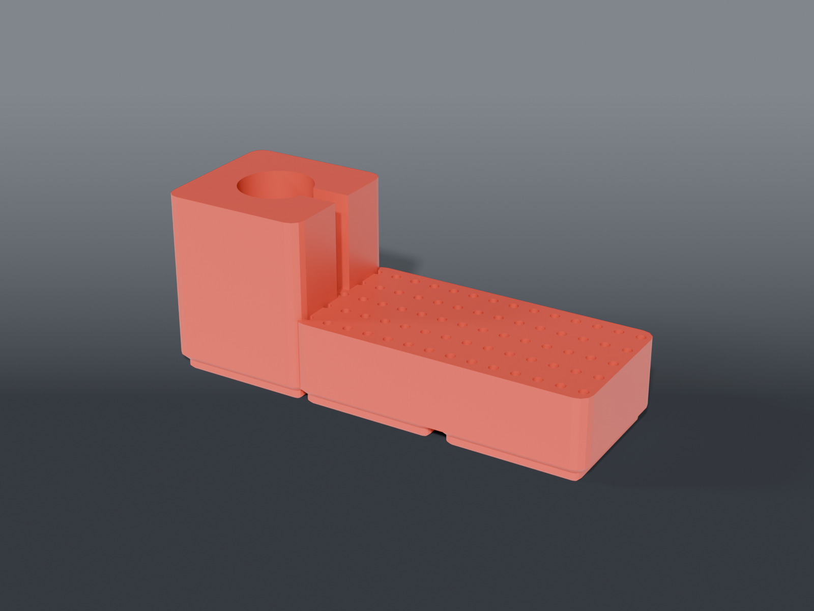

# Rotary tool station



**Gridfinity** holder for a **HARDELL mini rotary tool** and its accessory bits — the tool standing upright in a cup, the bits in a drilled block.

## Design notes

**The tool stands vertical in a 1 × 1 cup.** It's 131 mm long; the cup captures the bottom ~45 mm and the rest sticks up, like a pen in a pen cup. Laying it flat would need a 4 × 1 trough — four times the bench for the same tool.

**Cord slot.** The tool is corded (barrel jack), so the cup has a channel open to the rim for the lead. Without it the cord drapes over the edge and levers the tool sideways.

**Stored collet-down** so the burr is shrouded. A pointed bit at hand height on a reach-across bench is a snag you notice exactly once.

## ⚠️ Print the fit gauge first

`bit_fit_gauge.scad` is a calibration coupon, **not** a bench part. Small vertical holes come off an FDM printer undersize — inner-perimeter over-extrusion, typically 0.15–0.3 mm, and the exact amount is specific to your printer, nozzle, and filament.

The gauge is a strip of five holes (2.5–2.9 mm), each engraved with its modelled diameter. Print it, try a 3/32″ shank in each, find the one that slides in cleanly, and set `BIT_CLR` in `rotary_station_common.scad` so `BIT_SHANK (2.381) + BIT_CLR` matches it. Then print `bin_bits.scad`.

Skip this and you get a block of 70 holes that are all the same amount wrong.

## Parts

| File | What | Size |
|---|---|---|
| `bit_fit_gauge.scad` | **Print first** — five test holes, 2.5–2.9 mm, engraved | 95 × 24 × 9 mm |
| `bin_tool.scad` | 1 × 1 cup, tool vertical, cord slot | 42 × 42 × 51 mm |
| `bin_bits.scad` | 2 × 1 block, 14 × 5 grid of 3/32″ holes | 84 × 42 × 24 mm |

**The 70-hole count is an upper bound.** The set is 69 pieces, but not all are 3/32″ shank-mounted — cut-off discs and sanding drums come on mandrels, and the micro drill bits in the small case have their own shanks. Count what actually has a 3/32″ shank and drop `BIT_COLS` / `BIT_ROWS` to match.

Built on [`lib/vessel.scad`](../lib/vessel.scad) (the cup) and [`lib/syringe.scad`](../lib/syringe.scad) (the bore grid — the same module that racks syringes; a bit block is that with a smaller pitch).

## Source

```sh
openscad -o bin_tool.stl --export-format binstl bin_tool.scad
```

## Recommended print settings

| | |
|---|---|
| Material | PLA or PETG |
| Layer height | 0.2 mm (**0.12 for the bit block** — finer layers hold small-hole diameter better) |
| Walls | 3 perimeters |
| Infill | 15 % |
| Supports | **None** — the cord slot and all bores print without them |
