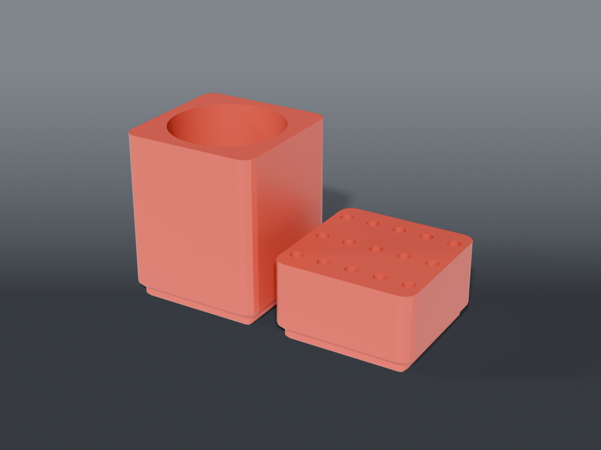

# Rotary tool station



**Gridfinity** holder for a **HARDELL mini rotary tool** and its accessory bits — the tool standing upright in a cup, the bits in a drilled block.

## Design notes

**The tool stands vertical in a 1 × 1 cup**, like a pen in a pen cup, capturing the bottom 45 mm. Laying a rotary tool flat needs a 4 × 1 trough — four times the bench for the same tool.

(The "131 mm long" that used to appear here was the *engraver's* length, carried over with the mis-attributed diameter. The HARDELL's own length has never been measured, and doesn't need to be — see below.)

**No cord slot.** The cup used to carry a channel open to the rim. The user doesn't want one (2026-08-31), so it's gone rather than widened — its 6 mm width was the *engraver's* barrel jack, inherited when the two tools were conflated, and had been flagged unverified for this tool since 2026-08-25.

**Stored collet-down** so the burr is shrouded. A pointed bit at hand height on a reach-across bench is a snag you notice exactly once.

## ✅ The fit gauge has been run

`coupons/bit_fit_gauge.scad` is a calibration coupon, **not** a bench part. Small vertical holes come off an FDM printer undersize — inner-perimeter over-extrusion, typically 0.15–0.3 mm, and the exact amount is specific to your printer, nozzle, and filament.

The gauge is a strip of five holes (2.5–2.9 mm), each engraved with its modelled diameter. It was printed on 2026-08-25 and **the shanks go into the 2.7**; the 2.6 does not take them. So `BIT_BORE = 2.70` and `BIT_CLR` is derived from it (0.319) rather than set by feel.

The old `BIT_CLR = 0.25` guess cut **2.631** — *under* the smallest hole that actually takes a shank. Every one of these holes would have needed reaming. That is exactly what the coupon exists to prevent.

**The HARDELL and the small engraver take the same bits**, confirmed 2026-08-25, so both share this bore. `../engraver-station/` uses the same 2.70.


## The cup was cut for the wrong tool for months

`TOOL_D = 19.66` sat here labelled HARDELL, and `bin_tool` was bored to it. On 2026-08-25 the
HARDELL measured **28 mm at the base, tapering to ≈30** — so 19.66 was never this tool. It's the
small engraver's, matching its ~20 mm to within 0.34 mm.

The old cup was watertight, 2-manifold, and exactly the size it claimed. It simply would not have
taken the tool named on it. **Nothing in the toolchain catches a right-shaped part cut for the
wrong object** — not the mesh check, not the asserts, not CI. Only a caliper on the right tool
does.

So the file moved rather than being deleted — it's now
[`../engraver-station/bin_tool_engraver.scad`](../engraver-station/), because the part was always
correct and only the label was wrong. `bin_tool` here is new, and now bored to a stated 34.

**The bore is stated, not derived — and that distinction is the fix.**

`collar_cup` cuts `vessel_d + CLR`, and the library's `CLR` is 1.0. Feeding it `TOOL_D = 30` therefore cut a **31.0** hole while every comment in the model claimed 30, and the number actually responsible was written down nowhere. The printed cup was too tight in the hand.

`TOOL_BORE = 34` is now the **finished hole**, the same way `BIT_BORE` is, and `bin_tool` passes `clr = 0` so nothing is added on top. Measured off the rendered mesh: a ⌀33.8 probe passes clean, ⌀34.6 hits material — the hole is 34.0 (33.98 across the flats at `$fn = 96`), leaving a 3.75 mm wall to the outer face.

> ⚠️ **34 is stated, not calipered** — *"i think the bore should be about 34"* (2026-08-31). The recorded taper is 28 at the base to ≈30 at its widest. If that still holds, a 34 bore leaves ~4 mm of slop and the tool leans ~5° in a 45 mm capture. That's a comfort call, not a fit failure: the bin latches into the grid, so nothing tips either way. Override with `-D TOOL_BORE=`.

## Parts

| File | What | Size |
|---|---|---|
| `coupons/bit_fit_gauge.scad` | **Print first** — five test holes, 2.5–2.9 mm, engraved | 95 × 24 × 9 mm |
| `bin_tool.scad` | 1 × 1 cup, HARDELL vertical (⌀34 bore), no cord slot | 42 × 42 × 51 mm |
| `bin_bits.scad` | 1 × 1 block, 5 × 3 grid, 15 bit holes | 42 × 42 × 24 mm |

**15 holes, counted 2026-08-25.** The kit came with about 15 shank bits, a stack of cut-off wheels and ~20 sanding disks.

It was 70 on a 2×1 — an upper bound from a 69-piece set, on the assumption every piece was shank-mounted. Most aren't, and the block was oversized by more than 4×. 5 × 3 on a 1×1 at an 8.4 × 14 pitch gives a cell back. The engraver's block took exactly this correction, 70 → 35.

The wheels and sanding disks are mandrel-mounted and want a **pocket, not a bore** — largest wheel is 25 mm across. Their bin is blocked on one measurement: the collet wrench's L × W × thickness.

Built on [`lib/vessel.scad`](../lib/vessel.scad) (the cup) and [`lib/syringe.scad`](../lib/syringe.scad) (the bore grid — the same module that racks syringes; a bit block is that with a smaller pitch).

## Source

```sh
openscad -o bin_tool.stl --export-format binstl bin_tool.scad
```

## Recommended print settings

| | |
|---|---|
| Material | PLA or PETG |
| Layer height | 0.2 mm (**0.12 for the bit block** — finer layers hold small-hole diameter better) |
| Walls | 3 perimeters |
| Infill | 15 % |
| Supports | **None** — every bore prints without them |
