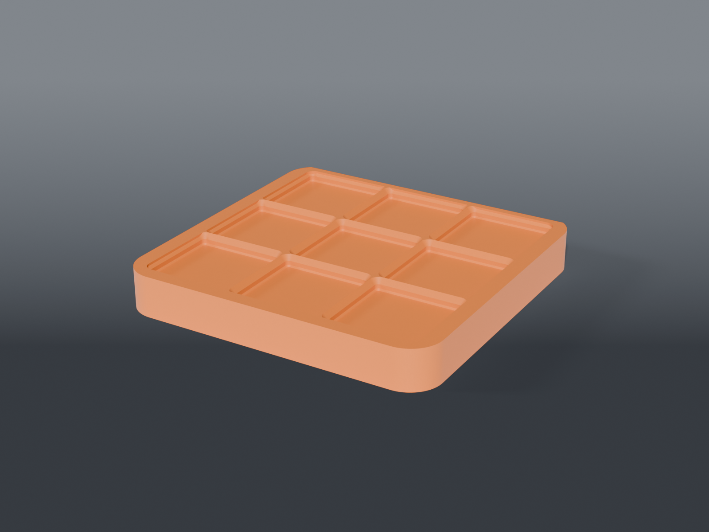

# Microscope base platform baseplate



A **3×3 Gridfinity baseplate** that drops onto the raised platform of a microscope boom stand's weighted base, reclaiming that dead footprint for storage — mainly a home for the Kimwipe box that already lives there. A skirt wraps the platform on three sides so it can't slide; the back is open where the boom pole comes up.

> **Not the oscilloscope.** That one is [`bench-instrument-risers/`](../bench-instrument-risers/). This is the *microscope* boom base.

## Parts

| Part | File | Size | Print |
|---|---|---|---|
| **Baseplate** | `scope_wipe_plate.scad` | 138 × 133.6 × 17.9 mm | ×1 — grid up, no supports |
| **Corner gauge** | `scope_corner_gauge.scad` | 192 × 94 × 3 mm | optional — only if your platform differs |

Shared dimensions live in `scope_plate_common.scad`.

## How it mounts

No hardware. The skirt drops 12 mm down the platform's 17.76 mm step and hugs it on the front and both sides; gravity and the three-sided wrap do the rest. The back is open so the boom pole passes through, and the plate stops exactly at the platform's back edge rather than growing into the pole.

## Fit

Measured on the actual stand:

| Dimension | Value | How |
|---|---|---|
| Platform | 131.84 × 130.54 mm | calipers |
| Step height | 17.76 mm | calipers — sets the 12 mm skirt depth |
| Corner radius | ~15 mm | **gauged**, not calipered |
| Kimwipe box | 119.60 × 122.86 mm | fits the 3×3 |

**The corner radius came from a gauge, because calipers can't read a fillet.** `scope_corner_gauge.scad` prints eight female corners from 6 to 20 mm; gauges 5 (14 mm) and 6 (16 mm) both seated.

`CORNER` is set to **14, not the midpoint 15** — the error is asymmetric. A larger `CORNER` rounds the skirt opening more, making it *smaller* at the corners, so it binds:

| `CORNER` | real R=14 | R=15 | R=16 |
|---|---|---|---|
| **14** | clears | clears | clears |
| 15 | **binds** | clears | clears |
| 16 | **binds** | **binds** | clears |

Taking the smaller gauge that seated clears the whole measured range, so no finer gauge is needed.

`FIT` is **1.2 mm**, deliberately not 0.4 — that's the same clearance over the same ~131 mm span that failed on the OWON tray frame. PETG shrinks ~0.5 mm across 131 mm, so an internal dimension prints undersize and binds.

If your stand differs, the knobs at the top of `scope_plate_common.scad` cover it: `PLAT_W`, `PLAT_D`, `STEP_H`, `CORNER`, `FIT`.

## Source

```sh
openscad -o scope_wipe_plate.stl --export-format binstl scope_wipe_plate.scad
```

`$fn` must be **≥ 60**. The border ring's inner boundary and the baseplate's outer boundary are rounded rects 1 mm apart with the same corner radius, so their arcs run nearly parallel; below 60 segments the facet vertices stitch into sub-micron sliver triangles and the mesh validator rejects the part. Swept 48–128: fails at 48 and 56, clean from 60 up. The file sets 96.

## Recommended print settings

| Setting | Value |
|---|---|
| Material | PETG or PLA — carries no load and isn't a spring |
| Orientation | Flat, grid up, as exported |
| Layer height | 0.2 mm |
| Walls | 3+ |
| Infill | 15 % |
| Supports | None |
