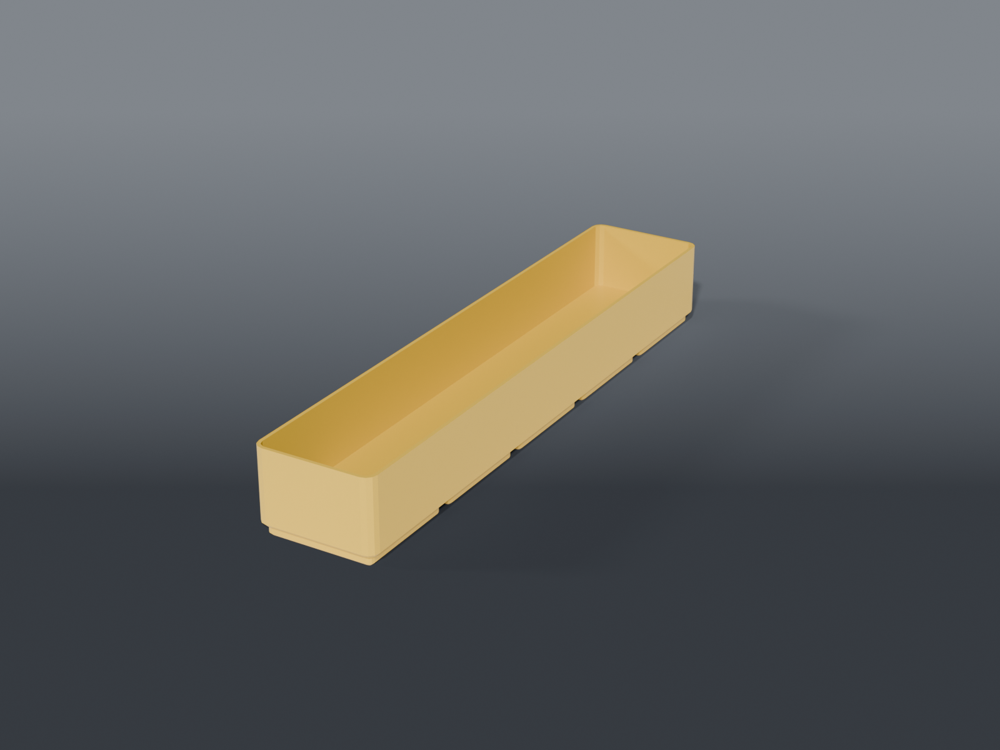

# Solder consumables



**Gridfinity** bins for the small consumables that live beside the iron — chip-removal alloy,
rosin, tip tinner.

## Parts

| File | What | Size |
|---|---|---|
| `bin_chip_remover.scad` | 1 × 5 trough for the chip-removal alloy tube | 41.5 × 209.5 × 30 mm |

**Plain bin, not a contoured cradle.** The tube is rigid and the bin has walls; a shaped channel
would only earn its place if the tube had to sit in one particular orientation, and it doesn't.
`TUBE_H` is the only parameter — raise it if the tube stands proud of the rim.

## Still to come

The **rosin tin** and **tip tinner tin** belong here too, as a small bored block rather than a
bin each — same form as the aerosol cups, much smaller. Both are unmeasured: each needs an outer
⌀ and a height. If the two tins share a diameter that's one bore size for both, and either tin
goes in either slot.

## Source

```sh
openscad -o bin_chip_remover.stl --export-format binstl bin_chip_remover.scad
```

## Recommended print settings

| | |
|---|---|
| Material | PLA or PETG |
| Layer height | 0.2 mm |
| Walls | 3 perimeters |
| Infill | 15 % |
| Supports | **None** |
