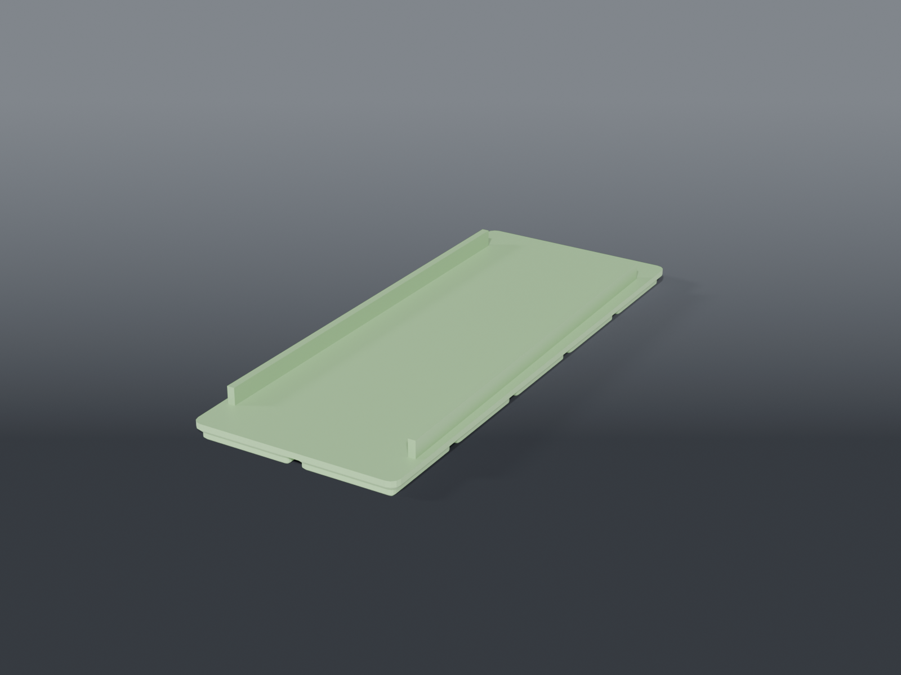

# Soldering station mounts



**Gridfinity** plates that anchor the existing soldering iron / desoldering gun stand to the
grid, so it stops wandering across the bench.

## The printed part takes no heat

The stand's own cradle holds the iron. This only stops the stand moving, so ordinary filament is
fine — that's the scope this whole family of mounts was defined with.

## Rails, not a pocket

The base is 70 mm across the front, 65 across the rear, 175 long — **and the sponge-tray end is a
large-radius D**, which those three numbers can't describe. A close-fitting pocket would need
that radius, and a wrong guess means the stand won't drop in at all.

Locating on the **straight sides only** sidesteps it. The taper does the work: the stand slides
in from the front and wedges between two converging rails. Both ends stay open, so the D never
has to be measured.

That's the general lesson worth keeping — when an outline is partly unknown, locate on the
features you *have* measured rather than guessing the ones you haven't.

## Parts

| File | What | Size |
|---|---|---|
| `plate_iron_stand.scad` | 2×5 plate, tapered side rails | 83.5 × 209.5 × 14.15 mm |

Rail gap runs 72 mm at the front to 67 at the rear — 1 mm clearance per side, deliberately tight
so the taper wedges rather than rattles.

## Source

```sh
openscad -o plate_iron_stand.stl --export-format binstl plate_iron_stand.scad
```

## Recommended print settings

| | |
|---|---|
| Material | PLA or PETG |
| Layer height | 0.2 mm |
| Walls | 3 perimeters |
| Infill | 15 % |
| Supports | **None** |
