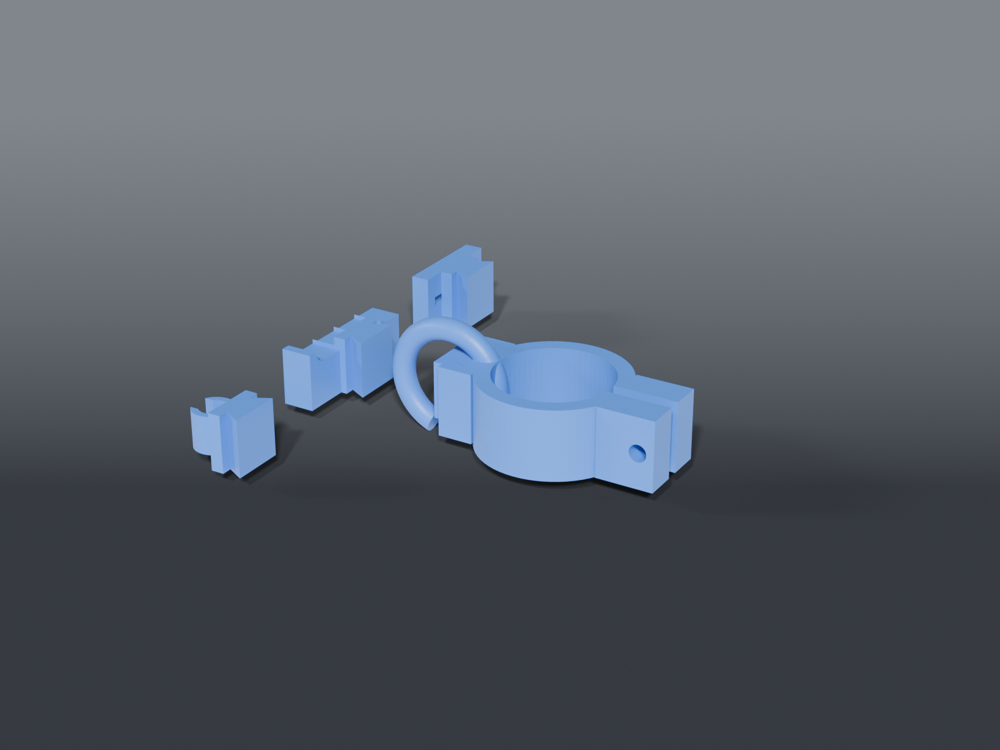

# Stand cable clamp



Modular cable management that pops onto round stand poles — speaker, projector, or lighting/laser stands. A split clamp cinches onto the pole with a wingnut, and cable heads slide onto a dovetail, so one clamp takes any attachment and you can reposition it tool-free.

Sized for the **On-Stage SS8800B+** upper shaft (**34.9 mm** / 38.1 mm with sleeve, also the universal 35 mm speaker-pole size) — but `tube_d` is a parameter, so set it to any pole (measure the crank-up column for a wider variant).

## Parts

| File | What |
|---|---|
| `clamp.scad` | Split C-clamp (set `tube_d`). Pops over the pole; M5 bolt + **wingnut** cinches it (bolt head captured in a hex pocket — only the wingnut turns). Dovetail mount on the face. |
| `head_hook.scad` | Open J-hook — drape/loop cables |
| `head_clip.scad` | Snap C-clip — grips a single cable (`CABLE_D`) |
| `head_comb.scad` | Multi-cable comb — a row of cable slots |
| `head_velcro.scad` | Velcro-strap slot — thread a hook-and-loop strap to bundle |

Heads are **universal** — they all share the dovetail, independent of `tube_d`. Slide on/off; no tools.

Built from `stand_cable_clamp_common.scad` (clamp + dovetail + head modules).

## Hardware

- 1× **M5 bolt + wingnut** per clamp (bolt head sits captive in the hex pocket; turn the wingnut to tighten). A printed thumb-knob works too.

## Source

```sh
openscad -o clamp.stl     --export-format binstl clamp.scad      # edit tube_d first
openscad -o head_hook.stl --export-format binstl head_hook.scad
# ...etc per head
```

Key parameters (top of `stand_cable_clamp_common.scad`): `TUBE_D`, `WALL`, `H`, the dovetail (`DT_*`), and `CABLE_D` for the clip/comb.

## Recommended print settings

| Setting | Value |
|---|---|
| Orientation | Clamp: ring flat on the bed. Heads: dovetail down. No supports. |
| Material | PETG (flexes without cracking at the split clamp) or PLA |
| Layer height | 0.2 mm |
| Walls / perimeters | 3–4 (clamp wants strength) |
| Infill | 30 % (clamp), 15 % (heads) |
| Supports | None |

> New mechanism — print one clamp + a head and check the pole grip and dovetail fit before running a batch. `tube_d`, the dovetail clearance (`DT_CLEAR`), and bore clearance (`CLEAR`) are the dials if anything's snug or loose.
