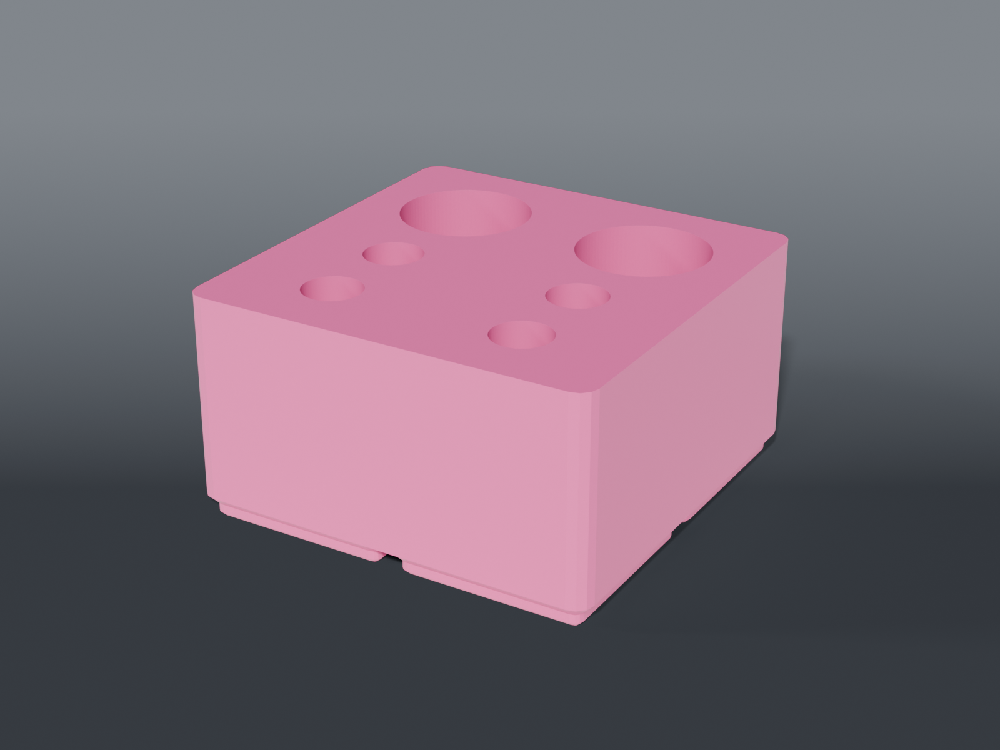

# Syringe holders



**Gridfinity** rack for the syringes that live on a rework bench — flux, paste, anything that comes in a barrel with a tip. Bores are vertical: nothing overhangs, so it prints without supports, and the syringes stand tip-down like pens in a cup.

## Design notes

**Two barrel sizes, one block.** Working syringes here are 10 cc (⌀10.8 mm) except the 30 cc flux (⌀25.5 mm). Rather than a rack per size, the bores are a position list — `[x, y, diameter]` — so one 2 × 2 block carries both.

**Big ones at the back.** The two 30 cc bores sit in the back row, the four 10 cc in front of them. A 30 cc barrel is nearly two and a half times the diameter and correspondingly taller; in front it blocks the view of everything behind it.

**The bore locates, it doesn't grip.** Clearance, not interference — same rule as [`lib/vessel.scad`](../lib/vessel.scad)'s collar cups. A bore that grips harder than the bin weighs lifts the bin out of the baseplate when you grab a syringe one-handed.

**40 mm capture, not the syringe's length.** A ~100 mm syringe stands well proud of a 46 mm block. Capture depth only has to resist a knock — this bench sits under a fume-extractor intake — not swallow the part.

## Parts

| File | What | Size |
|---|---|---|
| `bin_flux.scad` | 2 × 2 rack — 2 × 30 cc (⌀25.5) + 4 × 10 cc (⌀10.8), 40 mm bores | 83.5 × 83.5 × 46.2 mm |

Bore diameters and positions live in `syringe_holders_common.scad` (`D_LARGE`, `D_SMALL`, `FLUX_BORES`). Adding a size is a row in that list, not new geometry.

Built on [`lib/vessel.scad`](../lib/vessel.scad).

> **UV-curable mask syringes are not in here.** They cure under ambient light, so they need deep opaque bores and a cap — see [`uv-mask-station/`](../uv-mask-station/).

## Source

```sh
openscad -o bin_flux.stl --export-format binstl bin_flux.scad
```

## Recommended print settings

| | |
|---|---|
| Material | PLA or PETG |
| Layer height | 0.2 mm |
| Walls | 3 perimeters |
| Infill | 15 % |
| Supports | **None** — every bore is vertical |
