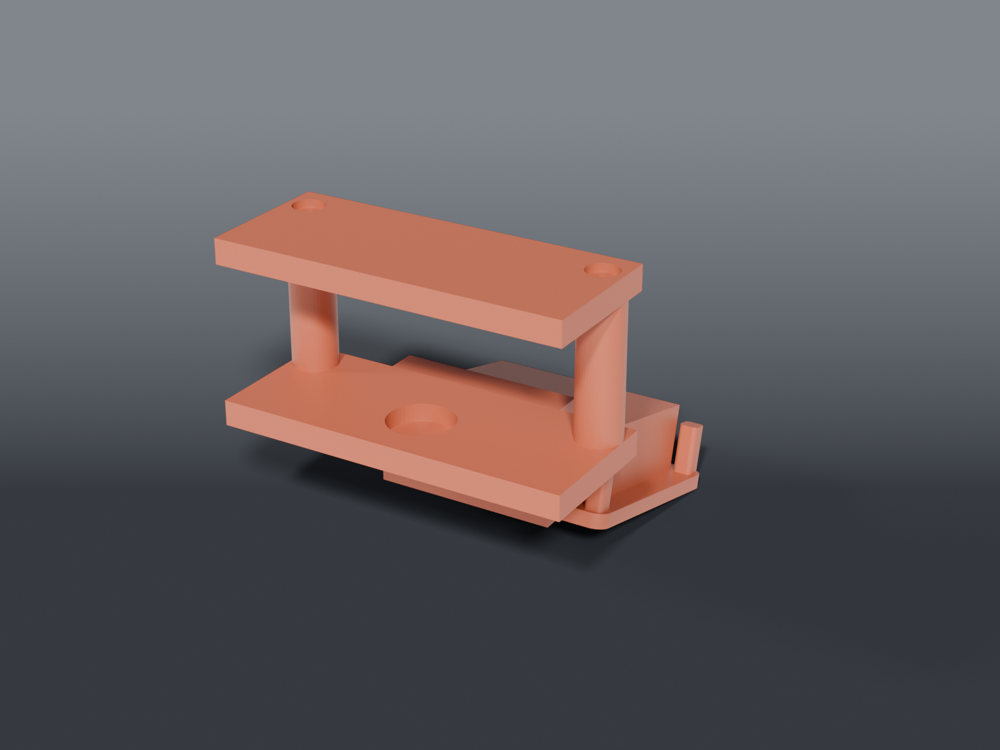

# Thermal cam mount



A two-part sandwich clamp on the LED-56S ring light's **control-box tab** (49.65 × 32.51 × 26.42),
carrying an **open tray** that a **Sipeed T256s** lies flat in, looking straight down at the board
through a window.

The T256s is registered onto the scope's visible feed so a hot component's bloom labels that
component. That registration transform is computed once and has to **hold between sessions** — so
the mount is rigid, non-drifting, and fixed-angle. Anything that can rotate or creep invalidates
the calibration.

## Parts

| File | What | Size |
|---|---|---|
| `mount_bottom.scad` | bottom plate + web + camera tray | 70.05 × 78.3 × 62.8 mm |
| `mount_top.scad` | top plate, counterbored | 70.05 × 28.0 × 5.0 mm |

Two M3 screws into heat-set inserts draw the plates together. Shared dimensions live in
`thermal_cam_mount_common.scad`.

## Why a sandwich and not a bracket

The tab is a **boss on top of the ring**, which rules out five of its six faces:

| Face | Why it's unusable |
|---|---|
| Rear | merges into the ring |
| Front | brightness wheel |
| Both sides | switch and jack |
| Bottom | centre screw |
| **Top** | **clear — the only one** |

So the plates grip the top and bottom faces over the front 28 mm of the tab's 32.51, and the two
screws pass **outboard** of the tab at the front corners — clear of the mid-side controls, either
side of the front wheel. No rear wall, no side walls.

The long top-and-bottom grip is the moment arm that resists the camera's weight tilting the whole
thing nose-down. The bottom plate carries a pocket for the tab's centre screw.

Tab measured 2026-07-23: **49.65 W × 32.51 front-to-back × 26.42 thick**.

## The camera lies flat in a tray

Modelled on the reference design the user supplied (*Thermal Camera Mount type 3 v3.2*): open tray,
round lens window, corner posts, shallow tilt. That reference **glues** to the ring; this clamps the
control-box tab instead, which is the half that already worked.

**This is what fixes the cable.** The old cradle stood the camera upright and tilted it 60°, which
aimed its top edge — where the male plug and the live cable are — at (0, −0.87, +0.50): up and
*inward*, straight at the objective. The cord crossed in front of the scope and made it unusable.

Lying flat, the plug edge points sideways, and **which** sideways is a free choice. It's set
**outboard**, away from the optical axis, and the tray's outboard border is notched so the plug and
lead drop clear.

| | |
|---|---|
| Tray tilt | **14°** — the reference's 14.1°, rounded |
| Lens window | 34 × 26 rounded rect |
| Posts | 4 × 4 mm, 10 mm tall, at the pocket corners |
| Plug notch | 14 mm, outboard border |

⚠️ **The window is deliberately oversize.** The notes record the thermal lens as "offset toward
LEFT" and that offset has never been measured. A window cut to a guessed centre would blind the
camera, and no mesh check catches a part that's the right shape over the wrong spot. 34 × 26 in a
42 × 35 body leaves a 4 mm border all round and clears the optic wherever it sits.

## The tray hangs BELOW the clamp

The control housing sits **behind** the lights and the space under it is clear. An earlier version
of this file claimed *"everything below the tab is the working volume"* and pushed the camera up on
top of the clamp. **That claim was wrong** and it is what put the camera in the worse place.

Below is better: it drops the camera about **34 mm**, much closer to the objective's plane, which
cuts the parallax the HUD registration has to correct — the whole reason the mount exists.

The pre-2026-08-08 version that hung below failed because of an **inverted tilt sign** that aimed
the lens up into the objective. That was a real bug, and the position got blamed for it. A flat
tray looking down through a window cannot repeat it.

`mount_bottom` now carries the web and tray; `mount_top` is a plain counterbored plate.

## Why the tray reaches 26 mm out

`ARM_FWD` is 26, not the old cradle's 19.5. At 19.5 the **bottom clamp plate** clipped the innermost
3.8 mm of the lens window about 35 mm down — the camera couldn't see the part of the board nearest
the objective, which is the only part worth seeing.

Swept against the real sight line: blocked at 19.5 and 22, clear from 24. 26 leaves 2 mm of margin.
Flattening the tilt to 8° also clears it, but that aims the lens nearer straight down and gives up
inward coverage. Reaching further out costs 6.5 mm of offset against a 175 mm field — nothing.

## The arm is a plain web, and that took five tries

Every attempt to `hull()` onto the tilted tray produced a different degeneracy on OpenSCAD 2021.01:

| Attempt | Result |
|---|---|
| Square patch, tray-sized | corners proud of the rounded outline — 4 non-manifold edges |
| Patch matching the outline exactly | hull arrives **tangent** to the tray's side walls — 10 edges |
| Patch butted on the tray's underside | three faces on one line — 2 edges |
| Patch pushed inside the tray | zero-length edge |
| Hull of two solid blocks | 4 edges |

Bisection put it on the arm-to-tray join every time — tray alone passed, arm alone passed, together
they failed, with or without the posts and the window.

A plain box has flat faces. Where it meets the tilted tray, two planes cross at 14° — an honest
intersection with nothing coincident, coplanar or tangent. It passes.

## The cradle rides above the plate, not below

The tab is coplanar with the ring light's disc, so **everything below it is the working volume**
between the objective and the board. The camera must never enter it.

An earlier version hung the cradle below the bottom plate, rotated `-(90 - CAM_ANGLE)`. That put
the camera in the working volume *and* aimed the lens 60° up into the objective — two failures at
once. Fixed 2026-08-08: the cradle sits above the top plate, just outboard of the tab's front
face, sighting down past the plate's front-top corner.

`verify_aim.py` exists so that can't regress silently. It checks the lens vector and the corner
clearance:

```sh
python3 verify_aim.py
```

```
lens vector  dY=-0.500 dZ=-0.866  -> 30.0 deg from vertical, INWARD, DOWN
  ray  9.0 deg  clearance  +1.30  ok
lowest cradle point z=18.36  (top plate underside z=13.36)  -> out of the working volume
PASS
```

**Run it before any print.** A mount that aims the lens at the objective still renders, still
slices, and still passes a mesh check.

## Still to confirm on the first print

- **`FIT = 0.3`** — the gap between each plate and the tab face. Too loose and the calibration
  drifts, which is the one thing this mount exists to prevent.
- **Front-corner screw clearance** — that the screws really do pass outboard of the wheel.
- **That the tab's top face is rigid ABS** before trusting the grip.

## Recommended print settings

| | |
|---|---|
| Material | PETG or ABS — not PLA, it creeps under clamp load |
| Layer height | 0.2 mm |
| Walls | 4 perimeters |
| Infill | 40 % — this is a clamp |
| Supports | **`mount_top`: YES. `mount_bottom`: none.** See below |

### Supports — mount_top only

Measured off the exported mesh, not eyeballed:

| Part | Surface that is unsupported overhang steeper than 45° |
|---|---|
| `mount_top` | **14.3%** |
| `mount_bottom` | **0.0%** |

`mount_top` carries two ~470 mm² faces that are **flat-down** — 0.1° off horizontal, hanging in
air — plus the cradle's 30° faces, because the cradle is tilted 60° from vertical by design. That
is not a marginal overhang; it is a ceiling.

This README said "Supports: none" for both parts until 2026-08-27, and a print was started on
that basis and killed. `mount_bottom` genuinely needs none — it is a plate with a pocket.

**Set supports per-object.** If both parts share a plate, a global support setting grows them
under `mount_bottom` for nothing.
