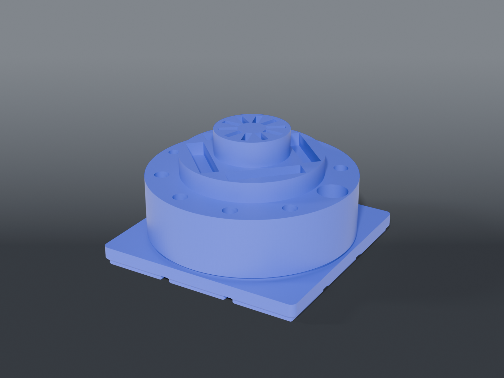

# Tool carousel



A **spinning three-tier carousel** for the hand tools that live closest to the board: the rechargeable driver and its bit blocks, a GameBit driver, picks, glue-removal brushes and a ring of tweezers. It turns on two 608 bearings, sits on a round base that works on a bare desk, and drops into a 3×3 Gridfinity dock on the bench.

## Parts

| Part | File | Size | Print |
|---|---|---|---|
| **Carousel** | `carousel.scad` | ⌀124 × 62 mm | ×1 — underside down, no supports |
| **Base** | `base.scad` | ⌀120 × 27 mm with the post | ×1 — feet down, no supports (four 12 mm bridges over the foot recesses) |
| **Dock** | `dock.scad` | 3×3 Gridfinity, 12 mm tall | ×1 — feet down, no supports |
| **Foot** | `foot.scad` | ⌀12.3 × 3 mm | ×4 — **TPU 95A** |

## Hardware

- **2 × 608-2RS bearings** (8 × 22 × 7). They press up into the carousel's hub from underneath: push the first one all the way up until it stops against the cone, then press the second in flush with the underside.

## What goes where

| Tier | Holds | Cut |
|---|---|---|
| Outer | rechargeable driver (17 mm tube, back end down) | 17.6 hole, 32 deep — clear of its buttons at ~53 mm |
| | GameBit driver (6 mm shaft down, ⌀22 handle up) | 6.6 hole, 31 deep; set out at r 55 so the handle clears the middle tier |
| | 6 picks (8 mm, largest) · 2 metal brushes (8.1 mm) | 8.6 / 8.7 holes, 32 deep |
| Middle | the rechargeable driver's 4 bit blocks (10 × 43 × 12, 6 bits each) | four pockets, 8 deep — 4 mm stands proud to lift a block out |
| Centre | 10 tweezers (10 × 2.75, largest) | radial slots 11.1 × 3.85, 25 deep |

The two drivers sit opposite each other so it balances when it spins.

## Every number is measured

Tool sizes are the user's calipers (`survey/MEASUREMENTS.md`, 2026-10-06 → 10-09). The bearing fits were **printed and tested**, not assumed:

| | modelled | how it was found |
|---|---|---|
| bearing seat | **22.1** | `coupons/bearing_fit_coupon.scad`, round 1 — the press fit of 21.9 / 22.1 / 22.3 / 22.5 |
| post | **8.1** | round 2 — every post from 7.7 to 8.0 was loose; 8.1 is snug, 8.2 and up don't go on |

Tool-hole clearance (`HOLE_CLR` 0.6, `SLOT_CLR`, `BLOCK_CLR`) is this design's choice; raise them if your printer runs tight.

## Assembly check

`check_assembly.py` puts the bearings, every tool, the base and the dock in their real positions and intersects them. Fourteen checks: nothing collides, the lower bearing rests on the shoulder by its inner race only, the upper bearing has 6+ mm of post, every tool reaches its floor, the GameBit handle clears its neighbours, and the base and carousel both clear the dock. Every "must be empty" check has a matching "must be material" probe, and `--selftest` breaks the geometry six ways and confirms each is caught.

```sh
python3 tool-carousel/check_assembly.py
python3 tool-carousel/check_assembly.py --selftest
```

## Recommended print settings

| Setting | Value |
|---|---|
| Material | PETG (carousel, base, dock) · TPU 95A (feet) |
| Layer height | 0.2 mm |
| Walls | 3 |
| Infill | 15% — the carousel is mostly solid by volume, so infill is what sets its weight |
| Supports | None |
