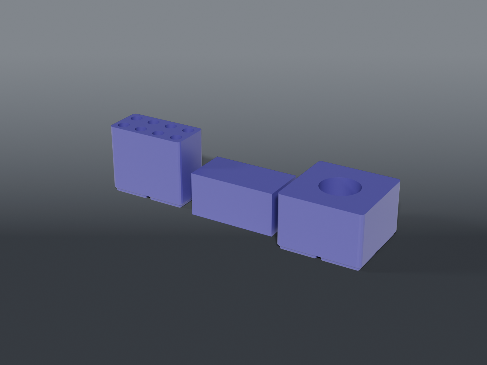

# UV mask station



**Gridfinity** storage for UV-curable solder mask and the 365 nm lamp that cures it — a deep-bore rack, an opaque cap over it, and a head-down cup for the lamp.

## ⚠️ Print the rack and the cap in opaque filament

The mask cures under UV, and ambient light carries enough of it to skin the syringe over weeks. Clear or natural PLA is a light pipe. **The rack and cap only do their job in an opaque colour** — black, or any dark solid. The lamp cup doesn't care.

That's also why the bores are 65 mm deep for a ~100 mm syringe: the tip and most of the barrel sit inside the block, and the cap covers the stubs that stick up. Deep bores plus a cap, not one or the other — a deep bore alone still leaves the top exposed, and a cap over shallow bores is a tall box.

## Design notes

**Syringes go in tip-down.** The tip is the part that skins first and the part you can't clear without wasting mask. Tip-down puts it at the bottom of the deepest, darkest part of the bore.

**The lamp is stored head-down** in a 2 × 2 cup, ⌀37.83 mm bore. Two reasons, and the second is the one that matters: the head is the widest part, so dropping it in self-centres the lamp — and a lamp knocked on in a head-down cup shines into the well instead of across the bench. 365 nm is an eye hazard, not just an inconvenience.

**Nine slots for seven syringes.** 3 × 3 grid: 2 green mask + 5 others, with two spare. The rack is a 2 × 2, not the 2 × 1 it started as — at the real 18.8 mm barrel a 2 × 1 fits **three** bores, not eight. Set `UVM_COLS` / `UVM_ROWS` in `uv_mask_common.scad` if your set is a different size.

**The cap clicks on — it isn't friction.** Four detents, one centred on each wall, drop into dimples **8 mm below the rack's top face** (`DET_BELOW_TOP`). Before this the cap was a plain box over a plain block at
0.25 mm per side with nothing holding it: for a cap whose only job is keeping UV off the mask,
lifting off unnoticed is the failure that costs you the syringes.

Catch depth is `DET_PROUD - CAP_CLR/2` — **0.34 mm** at the defaults — and the bump rubs the block
by that amount for `DET_BELOW_TOP` of travel, i.e. **8 mm**. Positioning the detent from the top
rather than from the cap's mouth is what keeps that short: measured the other way it landed
35 mm up a 71 mm block, halfway down, and dragged for 36 mm. **The catch depth itself is still
unverified on a real printer.**

Rather than gate it behind a coupon, the rack is built so it never needs reprinting: its dimples
are cut **0.99 mm deep against a 0.59 mm bump**, leaving 0.65 mm of headroom. `DET_PROUD` can go
as high as **1.25** before the rack is involved at all. So if the click is wrong, reprint the cap
— 48 cm³ — and leave the 309 cm³ rack alone.

A coupon was written for this and then deleted: at 22 cm³ it was 45 % of the cap it was
protecting, and nearly as long to print. Making the expensive half tuning-proof is the better
trade.

**The cap prints top-down, mouth up** — which is how it's emitted, so print it as exported. The solid 2 mm top lies on the bed and the walls rise from it.

Not mouth-down. The cavity is 84 mm across, so closing the top last means bridging 84 mm of open air, and the sag lands on the face that has to sit flat over the rack. The sealing rim does come out marginally crisper against the bed — that is not worth an 84 mm bridge. *(This README recommended mouth-down until 2026-08-19. It was wrong.)*

## Parts

| File | What | Size |
|---|---|---|
| `bin_uv_mask.scad` | 2 × 2 rack, 3 × 3 bores at ⌀18.8 × 65 mm deep — **print opaque** | 83.5 × 83.5 × 71.2 mm |
| `uv_mask_cap.scad` | Slip-over cap for the protruding stubs, 0.5 mm clearance — **print opaque** | 88.5 × 88.5 × 44.0 mm |
| `uv_light_holder.scad` | 2 × 2 cup for a TrixHub TH007 365 nm lamp, head-down | 83.5 × 83.5 × 56.2 mm |

Built on [`lib/syringe.scad`](../lib/syringe.scad) (the bore grid) and [`lib/vessel.scad`](../lib/vessel.scad) (the lamp cup).

## Source

```sh
openscad -o bin_uv_mask.stl --export-format binstl bin_uv_mask.scad
```

## Recommended print settings

| | |
|---|---|
| Material | PLA or PETG — **opaque** for the rack and cap |
| Layer height | 0.2 mm |
| Walls | 3 perimeters (don't drop below 2 on the rack — thin walls leak light) |
| Infill | 15 % |
| Supports | **None** — bores are vertical; the cap prints top-down as emitted, so nothing bridges |
