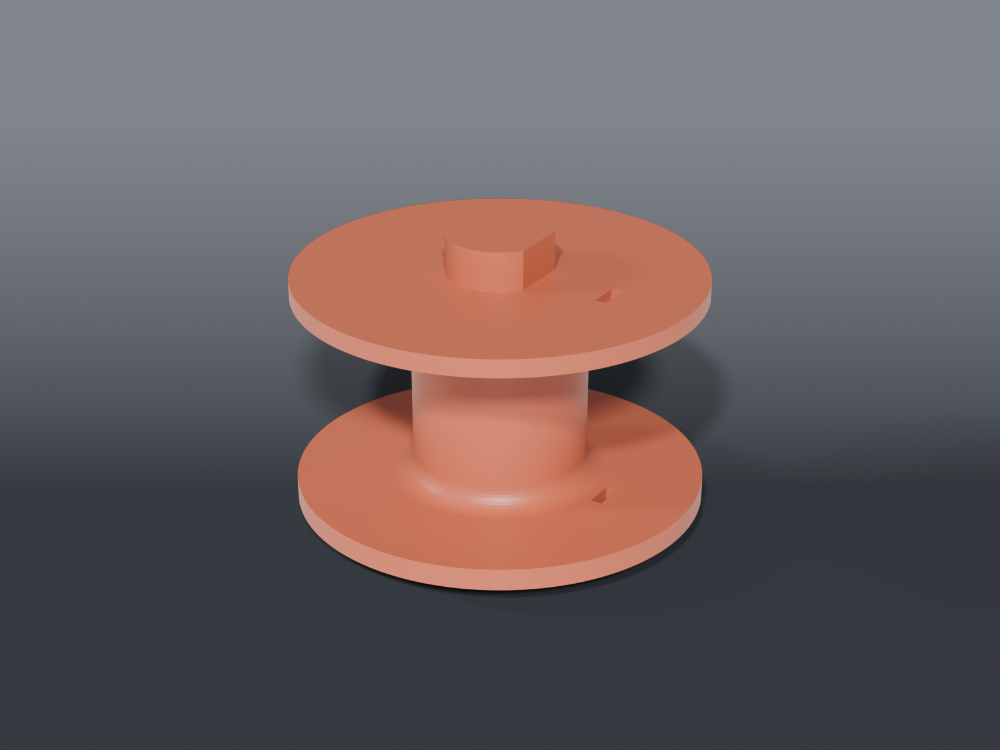

# Wick and solder spool

A **shaft that is a spool**, for the downloaded [1×3 Gridfinity Wick and Solder Spool Holder](https://www.thingiverse.com/). It replaces that model's plain shaft. The base and both brackets are unchanged — nothing already printed needs reprinting.

## Why it exists

The holder's shaft is ⌀14.60 and small-bore spools will not pass it; only its ⌀10.00 spigot is narrow enough. Narrowing the shaft does not work, because the ⌀14.60 is what locates it in the top bracket's ⌀15.00 bore — and a shaft needs a shoulder above ⌀10 to sit on the bottom bracket, so a spool that only clears ⌀10 cannot get past either end.

Winding onto the shaft itself removes the problem: there is no spool bore to match, because you are making the bore.

## Mounting — measured, do not change

Taken off the supplied STLs. The existing brackets are being kept, so none of it may move.

| | |
|---|---|
| bottom bracket bore | ⌀10.00, grips shaft-local z 0.15–3.65 |
| top bracket bore | ⌀15.00, grips shaft-local z 37.90–41.40 |
| overall length | 41.50 mm |
| free span between brackets | 34.25 mm |
| envelope before the flange fouls the bracket | ⌀60.0 |

⚠️ **The spigot is ⌀9.70, not ⌀10.00, and that is deliberate.** The original shaft was ⌀10.00 in a ⌀10.00 bore — a slip fit that never had to turn, because the spool spun on the shaft. Here the shaft *is* the spool, so that bore is a journal bearing now. At zero clearance it will not pay out wire at all. 0.30 mm matches the intent of the top journal's existing 0.40.

## Two parts, and the split is for printing

Printed upright in one piece, both flange undersides are flat ceilings. Making them self-supporting costs 45° cones that eat 20–37 mm of a 34 mm span — ⌀48 and up will not fit at all, and the self-supporting version collapses to **6.9 cm³**.

Splitting at the **upper flange's underside** gives 58.8 cm³ with no towers:

| part | print | support |
|---|---|---|
| `spool_lower.scad` | spigot-down, as emitted | a short ring under the lower flange, 3.80 mm above the bed |
| `spool_upper.scad` | flange-down, as emitted — 2463 mm² on the bed | **none** |

⚠️ **Do not split it mid-hub.** That was the first idea and it is wrong: the upper half becomes hub-then-flange, which overhangs whichever way up you print it.

## The joint

The two halves are trapped between the brackets once installed, so the joint only has to survive winding and handling — which are exactly what a plain friction fit is worst at. So it does both jobs explicitly:

- a **flat** on the ⌀10 boss carries torque, so cranking does not rely on friction
- a **ring ridge** snaps into a groove, so it does not come apart when carried

The ridge is two stacked cones rather than a torus. A torus meets the bore on a tangent line, and tangency in a boolean is what this repo keeps paying for.

## Capacity

⌀56 flanges over a ⌀24 hub, 27.2 mm of winding width — **54.7 cm³**.

`HUB_D` is also the tightest bend the braid sees; raise it if the braid resists the wind.

## Respooler — with a crank

Winding 15 m of braid is **126–149 turns**. Pinching a ⌀56 flange means re-gripping every half turn —
a doorknob, 140 times. The crank makes it steady winding.

**It drives from outside the holder.** Installed, the spool's journal top is flush with the bracket
(41.40 vs 41.50) and there is nothing to grip. Out of the holder the whole 5.5 mm journal is exposed,
so the spool stands in `respool_winder` while you wind, and goes back to the holder to live.

**The journal carries two flats**, 12.00 across a ⌀14.60 body. The flats take the torque so the crank
does not rely on friction, which printed-on-printed never survives. They do not affect the holder —
its bore is ⌀15.00 and round, and the two remaining arcs still locate the journal exactly as before.

A hex socket down the journal's top face was considered first and does not fit: the joint socket
already eats 33.50–39.50, leaving 2 mm of solid. Flipping the joint to free it would put the upper
half's boss below its own bed surface when printed flange-down, costing that part its support-free
print.

## Source stand

The printed spool already spins in the holder's own brackets; that is what its 0.30 mm spigot and
0.40 mm journal clearances are for. Winding 15 m of 3 mm braid is only **~126–149 turns** on a ⌀56
flange you can grip. So you turn it by hand and the stand just feeds it.

An earlier sketch had a crank, a driven upright, and two flats milled on the journal to drive it —
a spool revision for a problem that does not exist.

**The existing holder cannot host the source spools.** Both fail, for different reasons, which is the
only reason a stand is needed:

| source spool | | |
|---|---|---|
| solder braid | ⌀48.50 × 44.75 wide, bore 10.25 | 44.75 wide vs a 34.25 mm span — **too wide** |
| micro wire #1/#2 | ⌀69.13 × 13.50 wide, bore 11.30 | ⌀69.13 vs a ⌀60 envelope — **too big** |

The ⌀9.9 post clears both bores. The drag washer is what makes the wind tight: without it the source
overruns whenever you pause. Its own weight supplies the drag — deliberately not a spring, because a
printed spring at this size relaxes and this has to behave the same on a 44.75 mm spool and a 13.50
mm one.

## Parts

| file | what |
|---|---|
| `spool_common.scad` | measured mounting dimensions, envelope, joint |
| `spool_lower.scad` | spigot, lower flange, full hub, joint boss |
| `spool_upper.scad` | upper flange, journal, joint socket |
| `respool_common.scad` | source-spool dimensions and stand geometry |
| `respool_stand.scad` | 2×2 base + ⌀9.9 post — 83.5 × 83.5 × 64 mm, ~67 g |
| `respool_drag_washer.scad` | ⌀40 × 6 disc — ~9 g |
| `respool_winder.scad` | 2×2 plate with a ⌀10.00 socket — the spool stands in it to be wound, ~62 g |
| `respool_crank.scad` | D-socket crank for the journal's flats — ~17 g |
