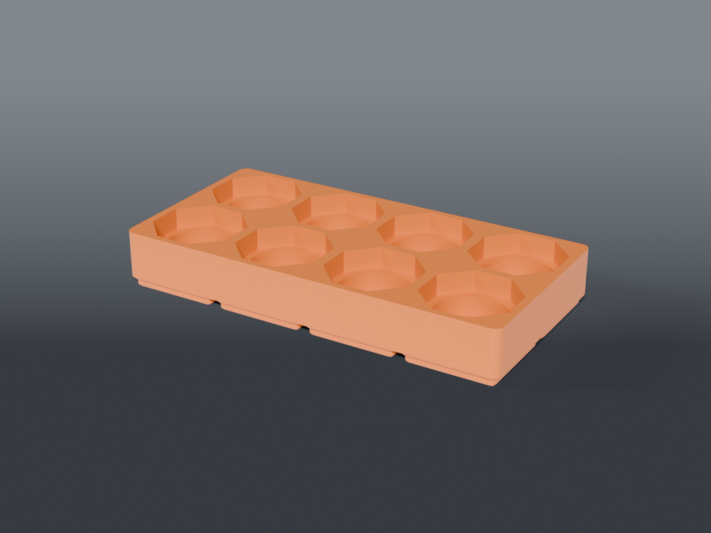

# Wolfbox MF50 nozzle bin

A **4×2 Gridfinity bin with eight octagonal nozzle pockets** for the Wolfbox MF50.

## Parts

| Part | File | Size | Print |
|---|---|---|---|
| **Nozzle bin** | `bin_nozzles_mf50.scad` | 167.5 × 83.5 × 24.75 mm | ×1 — feet down, no supports |

206.6 cm³, about 92 g.

## Why this replaces the downloaded model

The MakerWorld model this is based on is **labelled Gridfinity and isn't**. Measured off its mesh:

| | that model | Gridfinity |
|---|---|---|
| footprint | 90.00 × 133.00 | 83.50 × 125.50 for 2×3 |
| in cells | **2.155 × 3.179** | whole numbers |
| foot | **none** — 90 × 133 constant from 0.8 mm to the rim | steps 79.20 → 83.50 in *both* axes between 2.2 and 3.0 mm |
| mesh | **30 non-manifold edges** | watertight |

It would drop into a 2×3 area, sit loose, and latch onto nothing.

## The pocket geometry is kept, because that part was right

Rastered cross-sections of the original at two heights — six pockets on a 2×3 grid at a clean 43 mm pitch:

| | measured |
|---|---|
| collar recess | 36.8 across flats, 39.87 across corners, 9 mm deep |
| bore | 30.40, 8 mm deep |
| floor | 3 mm |

⚠️ **The recess is an octagon, not a hexagon.** The corner-to-flat ratio measures **1.089**; a regular hexagon is 1.155 and a regular octagon 1.082. It reads as a hex in a render and is not one. Confirmed against the nozzles themselves.

**A regular octagon's bounding box is its across-flats, not its across-corners** — the corners sit at ±22.5° and fall *inside* the box. Sizing the pitch off 39.87 suggested 1.4 mm walls between pockets and nearly cost the layout; the real figure is 36.8, which leaves plenty:

| | pitch | wall |
|---|---|---|
| X | 41.28 | **4.48 mm** |
| Y | 40.55 | **3.75 mm** |

## Verified

Rastered the finished bin with the same method used on the original, so the figures are directly comparable:

- **8 pockets**, evenly spaced; octagon **36.40 × 36.40**, corner-⌀ **39.52**; bore **30.40** — matching the original within raster resolution
- single connected body
- **no supports**: 9.4% overhang against a plain `bin_blank(4,2)`'s 12.8%, with an *identical* 306.7 mm² above 50°. The pockets add no steep overhang — all of it is the standard Gridfinity foot
- clean on **OpenSCAD 2021.01**, what CI runs

## Eight, not six

The stock nozzles are covered by the existing holder; this one is for the aftermarket set.

## Recommended print settings

| Setting | Value |
|---|---|
| Material | PETG |
| Layer height | 0.2 mm |
| Walls | 3 |
| Infill | 15% grid |
| Supports | **None** |
